# 目录

1. 项目背景介绍
   - 密码子偏好简述、生物学动因
   - 数据集介绍（UCI Codon Usage）

2. 数据预处理与可视化
   - 数据导入
   - 数据处理
   - 可视化

3. PCA 与聚类分析
   - 函数定义
   - 聚类分析
   - 生物学解释与讨论

4. 分类模型：Kingdom 分类
   - 随机森林准确率、混淆矩阵、特征重要性
   - 分类模型效果分析

5. 扩展分析与建议
   - DNAtype 分类模型展望
   - CAI/Nc/GC3 比较建议
   - 生物意义深挖建议

6. 结论
   - 密码子偏好具有强分类能力
   - 可揭示系统发育演化线索
   - 模型预测与生物假说验证结合潜力大


# 一、项目背景介绍

## 密码子偏好简述
在遗传信息的传递过程中，**密码子（codon）**是由三个核苷酸组成的碱基三联体，每个密码子对应一个特定的氨基酸或翻译终止信号。尽管存在**64种可能的密码子**，但它们所编码的氨基酸仅有20种，这种冗余被称为**密码子的简并性（degeneracy）**。

由于多种密码子可以编码相同的氨基酸，生物体在进化过程中表现出对某些同义密码子的偏好使用，这种现象被称为**密码子偏好（codon usage bias）**。密码子偏好并非随机，而是受到以下多个因素的影响：

* **tRNA丰度**：与频繁使用的密码子相对应的tRNA分子通常更丰富，从而提高翻译效率。
* **基因表达水平**：高度表达的基因往往偏好使用效率更高的密码子以加快蛋白质合成。
* **GC含量**：基因组中GC含量的差异会导致密码子选择偏向GC或AT结尾。
* **物种特异性与进化压力**：不同物种的密码子偏好模式具有显著差异，反映出其进化历史和生态适应。

密码子偏好的研究在多个领域具有重要意义，包括：

* **分子进化与系统发育分析**
* **基因表达调控机制的理解**
* **异源基因表达优化**，如在大肠杆菌中表达真核基因时需进行密码子优化
* **病毒宿主适应性研究**

因此，对密码子使用模式进行系统性分析有助于揭示生物的遗传特征与进化策略，并能为基因工程和合成生物学等应用提供理论支持。

## 数据集介绍：UCI Codon Usage

本研究所使用的数据集为 **Codon Usage Database**，来源于 [UCI Machine Learning Repository](https://archive.ics.uci.edu/)，通常简称为 **UCI Codon Usage 数据集**。该数据集由生物学家构建，旨在分析不同生物中基因序列的**同义密码子使用偏好**，广泛用于基因识别、物种分类和分子进化研究。

### 数据集概况

* **数据量**：包含 **13028 条记录**，每条记录代表一个基因。
* **特征维度**：共有 **64 个密码子频率特征**，每个值表示该密码子在该基因中的相对使用频率（占全部密码子频率之和）。
* **分类标签**：

  * **Kingdom（域）**：每条记录被标注为所属的11种生物类别之一，例如：

    * `bct`（bacteria，细菌）
    * `pln`（plants，植物）
    * `vrt`（vertebrates，脊椎动物）
    * `phg`（phage，噬菌体）等
  * **DNAtype**：标记该基因来自的DNA类型（如线粒体DNA、叶绿体DNA等），共13类，用数字0\~12表示。
* **数据格式**：以 CSV 格式存储，每行为一个样本，包含64个数值特征与对应标签。

### 数据预处理说明

原始数据中的密码子频率经过标准化处理，确保其对不同基因长度具有可比性。在实际应用中，为了方便进行聚类分析和主成分分析（PCA），数据集通常还需进一步中心化、归一化或降维。

### 数据价值

UCI Codon Usage 数据集提供了跨物种、跨DNA类型的详尽密码子使用频率数据，是研究密码子偏好、基因分类、生物进化、以及开发生物信息学模型的理想资源。

# 二、数据预处理与可视化

## 数据导入

### 导入所需的函数库


```python
import os
import pandas as pd
import matplotlib.pyplot as plt
import numpy as np
import seaborn as sns
from sklearn.cluster import KMeans
from sklearn.decomposition import PCA
from sklearn.ensemble import RandomForestClassifier
from sklearn.metrics import silhouette_score, adjusted_rand_score, normalized_mutual_info_score, classification_report, confusion_matrix
from sklearn.model_selection import train_test_split
from sklearn.preprocessing import StandardScaler, LabelEncoder
from mpl_toolkits.mplot3d import Axes3D
from scipy.cluster.hierarchy import dendrogram, linkage
```


```python
# 字体设置
plt.rcParams['font.family'] = ['SimHei', 'Arial', 'sans-serif']
plt.rcParams['axes.unicode_minus'] = False
# 设置当前的路径
current_path=os.getcwd()
dir_path=os.path.dirname(current_path)
# 设置数据文件的路径
data_path=dir_path+"\\data\\codon_usage.csv"
print("当前的数据文件的路径为：",data_path)

# 设定保存图片的路径
images_path=dir_path+"\\output\\images\\"
```

    当前的数据文件的路径为： G:\JupyterNotebook\Internship\密码子项目\data\codon_usage.csv
    


```python
cluster_path=dir_path+"\\output\\cluster\\"
```

### 导入数据


```python
codon_usage = pd.read_csv(data_path,low_memory=False)
df=codon_usage # df为原始数据

# 查看前几行
df.head()
```


<div>
<style scoped>
    .dataframe tbody tr th:only-of-type {
        vertical-align: middle;
    }

    .dataframe tbody tr th {
        vertical-align: top;
    }

    .dataframe thead th {
        text-align: right;
    }
</style>
<table border="1" class="dataframe">
  <thead>
    <tr style="text-align: right;">
      <th></th>
      <th>Kingdom</th>
      <th>DNAtype</th>
      <th>SpeciesID</th>
      <th>Ncodons</th>
      <th>SpeciesName</th>
      <th>UUU</th>
      <th>UUC</th>
      <th>UUA</th>
      <th>UUG</th>
      <th>CUU</th>
      <th>...</th>
      <th>CGG</th>
      <th>AGA</th>
      <th>AGG</th>
      <th>GAU</th>
      <th>GAC</th>
      <th>GAA</th>
      <th>GAG</th>
      <th>UAA</th>
      <th>UAG</th>
      <th>UGA</th>
    </tr>
  </thead>
  <tbody>
    <tr>
      <th>0</th>
      <td>vrl</td>
      <td>0</td>
      <td>100217</td>
      <td>1995</td>
      <td>Epizootic haematopoietic necrosis virus</td>
      <td>0.01654</td>
      <td>0.01203</td>
      <td>0.00050</td>
      <td>0.00351</td>
      <td>0.01203</td>
      <td>...</td>
      <td>0.00451</td>
      <td>0.01303</td>
      <td>0.03559</td>
      <td>0.01003</td>
      <td>0.04612</td>
      <td>0.01203</td>
      <td>0.04361</td>
      <td>0.00251</td>
      <td>0.00050</td>
      <td>0.00000</td>
    </tr>
    <tr>
      <th>1</th>
      <td>vrl</td>
      <td>0</td>
      <td>100220</td>
      <td>1474</td>
      <td>Bohle iridovirus</td>
      <td>0.02714</td>
      <td>0.01357</td>
      <td>0.00068</td>
      <td>0.00678</td>
      <td>0.00407</td>
      <td>...</td>
      <td>0.00136</td>
      <td>0.01696</td>
      <td>0.03596</td>
      <td>0.01221</td>
      <td>0.04545</td>
      <td>0.01560</td>
      <td>0.04410</td>
      <td>0.00271</td>
      <td>0.00068</td>
      <td>0.00000</td>
    </tr>
    <tr>
      <th>2</th>
      <td>vrl</td>
      <td>0</td>
      <td>100755</td>
      <td>4862</td>
      <td>Sweet potato leaf curl virus</td>
      <td>0.01974</td>
      <td>0.0218</td>
      <td>0.01357</td>
      <td>0.01543</td>
      <td>0.00782</td>
      <td>...</td>
      <td>0.00596</td>
      <td>0.01974</td>
      <td>0.02489</td>
      <td>0.03126</td>
      <td>0.02036</td>
      <td>0.02242</td>
      <td>0.02468</td>
      <td>0.00391</td>
      <td>0.00000</td>
      <td>0.00144</td>
    </tr>
    <tr>
      <th>3</th>
      <td>vrl</td>
      <td>0</td>
      <td>100880</td>
      <td>1915</td>
      <td>Northern cereal mosaic virus</td>
      <td>0.01775</td>
      <td>0.02245</td>
      <td>0.01619</td>
      <td>0.00992</td>
      <td>0.01567</td>
      <td>...</td>
      <td>0.00366</td>
      <td>0.01410</td>
      <td>0.01671</td>
      <td>0.03760</td>
      <td>0.01932</td>
      <td>0.03029</td>
      <td>0.03446</td>
      <td>0.00261</td>
      <td>0.00157</td>
      <td>0.00000</td>
    </tr>
    <tr>
      <th>4</th>
      <td>vrl</td>
      <td>0</td>
      <td>100887</td>
      <td>22831</td>
      <td>Soil-borne cereal mosaic virus</td>
      <td>0.02816</td>
      <td>0.01371</td>
      <td>0.00767</td>
      <td>0.03679</td>
      <td>0.01380</td>
      <td>...</td>
      <td>0.00604</td>
      <td>0.01494</td>
      <td>0.01734</td>
      <td>0.04148</td>
      <td>0.02483</td>
      <td>0.03359</td>
      <td>0.03679</td>
      <td>0.00000</td>
      <td>0.00044</td>
      <td>0.00131</td>
    </tr>
  </tbody>
</table>
<p>5 rows × 69 columns</p>
</div>


### 描述性统计


```python
#查看数据基本信息
df.info()

# 查看缺失值
df.isnull().sum()

# 描述性统计
df.describe()
```

    <class 'pandas.core.frame.DataFrame'>
    RangeIndex: 13028 entries, 0 to 13027
    Data columns (total 70 columns):
     #   Column       Non-Null Count  Dtype  
    ---  ------       --------------  -----  
     0   Kingdom      13028 non-null  object 
     1   DNAtype      13028 non-null  int64  
     2   SpeciesID    13028 non-null  int64  
     3   Ncodons      13028 non-null  int64  
     4   SpeciesName  13028 non-null  object 
     5   UUU          13028 non-null  object 
     6   UUC          13028 non-null  object 
     7   UUA          13028 non-null  float64
     8   UUG          13028 non-null  float64
     9   CUU          13028 non-null  float64
     10  CUC          13028 non-null  float64
     11  CUA          13028 non-null  float64
     12  CUG          13028 non-null  float64
     13  AUU          13028 non-null  float64
     14  AUC          13028 non-null  float64
     15  AUA          13028 non-null  float64
     16  AUG          13028 non-null  float64
     17  GUU          13028 non-null  float64
     18  GUC          13028 non-null  float64
     19  GUA          13028 non-null  float64
     20  GUG          13028 non-null  float64
     21  GCU          13028 non-null  float64
     22  GCC          13028 non-null  float64
     23  GCA          13028 non-null  float64
     24  GCG          13028 non-null  float64
     25  CCU          13028 non-null  float64
     26  CCC          13028 non-null  float64
     27  CCA          13028 non-null  float64
     28  CCG          13028 non-null  float64
     29  UGG          13028 non-null  float64
     30  GGU          13028 non-null  float64
     31  GGC          13028 non-null  float64
     32  GGA          13028 non-null  float64
     33  GGG          13028 non-null  float64
     34  UCU          13028 non-null  float64
     35  UCC          13028 non-null  float64
     36  UCA          13028 non-null  float64
     37  UCG          13028 non-null  float64
     38  AGU          13028 non-null  float64
     39  AGC          13028 non-null  float64
     40  ACU          13028 non-null  float64
     41  ACC          13028 non-null  float64
     42  ACA          13028 non-null  float64
     43  ACG          13028 non-null  float64
     44  UAU          13028 non-null  float64
     45  UAC          13028 non-null  float64
     46  CAA          13028 non-null  float64
     47  CAG          13028 non-null  float64
     48  AAU          13028 non-null  float64
     49  AAC          13028 non-null  float64
     50  UGU          13028 non-null  float64
     51  UGC          13028 non-null  float64
     52  CAU          13028 non-null  float64
     53  CAC          13028 non-null  float64
     54  AAA          13028 non-null  float64
     55  AAG          13028 non-null  float64
     56  CGU          13028 non-null  float64
     57  CGC          13028 non-null  float64
     58  CGA          13028 non-null  float64
     59  CGG          13028 non-null  float64
     60  AGA          13028 non-null  float64
     61  AGG          13028 non-null  float64
     62  GAU          13028 non-null  float64
     63  GAC          13028 non-null  float64
     64  GAA          13028 non-null  float64
     65  GAG          13028 non-null  float64
     66  UAA          13028 non-null  float64
     67  UAG          13028 non-null  float64
     68  UGA          13028 non-null  float64
     69  GC           13028 non-null  float64
    dtypes: float64(63), int64(3), object(4)
    memory usage: 7.0+ MB
    


<div>
<style scoped>
    .dataframe tbody tr th:only-of-type {
        vertical-align: middle;
    }

    .dataframe tbody tr th {
        vertical-align: top;
    }

    .dataframe thead th {
        text-align: right;
    }
</style>
<table border="1" class="dataframe">
  <thead>
    <tr style="text-align: right;">
      <th></th>
      <th>DNAtype</th>
      <th>SpeciesID</th>
      <th>Ncodons</th>
      <th>UUA</th>
      <th>UUG</th>
      <th>CUU</th>
      <th>CUC</th>
      <th>CUA</th>
      <th>CUG</th>
      <th>AUU</th>
      <th>...</th>
      <th>AGA</th>
      <th>AGG</th>
      <th>GAU</th>
      <th>GAC</th>
      <th>GAA</th>
      <th>GAG</th>
      <th>UAA</th>
      <th>UAG</th>
      <th>UGA</th>
      <th>GC</th>
    </tr>
  </thead>
  <tbody>
    <tr>
      <th>count</th>
      <td>13028.000000</td>
      <td>13028.000000</td>
      <td>1.302800e+04</td>
      <td>13028.000000</td>
      <td>13028.000000</td>
      <td>13028.000000</td>
      <td>13028.000000</td>
      <td>13028.000000</td>
      <td>13028.000000</td>
      <td>13028.000000</td>
      <td>...</td>
      <td>13028.000000</td>
      <td>13028.000000</td>
      <td>13028.000000</td>
      <td>13028.000000</td>
      <td>13028.000000</td>
      <td>13028.000000</td>
      <td>13028.000000</td>
      <td>13028.000000</td>
      <td>13028.000000</td>
      <td>13028.000000</td>
    </tr>
    <tr>
      <th>mean</th>
      <td>0.367209</td>
      <td>130451.105926</td>
      <td>7.960576e+04</td>
      <td>0.020637</td>
      <td>0.014104</td>
      <td>0.017820</td>
      <td>0.018288</td>
      <td>0.019044</td>
      <td>0.018450</td>
      <td>0.028352</td>
      <td>...</td>
      <td>0.009929</td>
      <td>0.006422</td>
      <td>0.024178</td>
      <td>0.021164</td>
      <td>0.028290</td>
      <td>0.021683</td>
      <td>0.001645</td>
      <td>0.000592</td>
      <td>0.006178</td>
      <td>0.754625</td>
    </tr>
    <tr>
      <th>std</th>
      <td>0.688726</td>
      <td>124787.086107</td>
      <td>7.197010e+05</td>
      <td>0.020709</td>
      <td>0.009280</td>
      <td>0.010586</td>
      <td>0.014572</td>
      <td>0.024250</td>
      <td>0.016578</td>
      <td>0.017507</td>
      <td>...</td>
      <td>0.008574</td>
      <td>0.006387</td>
      <td>0.013828</td>
      <td>0.013041</td>
      <td>0.014342</td>
      <td>0.015018</td>
      <td>0.001834</td>
      <td>0.000907</td>
      <td>0.010344</td>
      <td>0.159772</td>
    </tr>
    <tr>
      <th>min</th>
      <td>0.000000</td>
      <td>7.000000</td>
      <td>1.000000e+03</td>
      <td>0.000000</td>
      <td>0.000000</td>
      <td>0.000000</td>
      <td>0.000000</td>
      <td>0.000000</td>
      <td>0.000000</td>
      <td>0.000000</td>
      <td>...</td>
      <td>0.000000</td>
      <td>0.000000</td>
      <td>0.000000</td>
      <td>0.000000</td>
      <td>0.000000</td>
      <td>0.000000</td>
      <td>0.000000</td>
      <td>0.000000</td>
      <td>0.000000</td>
      <td>0.215922</td>
    </tr>
    <tr>
      <th>25%</th>
      <td>0.000000</td>
      <td>28850.750000</td>
      <td>1.602000e+03</td>
      <td>0.005610</td>
      <td>0.007108</td>
      <td>0.010890</td>
      <td>0.007830</td>
      <td>0.005307</td>
      <td>0.007180</td>
      <td>0.016360</td>
      <td>...</td>
      <td>0.001690</td>
      <td>0.001170</td>
      <td>0.012380</td>
      <td>0.011860</td>
      <td>0.017360</td>
      <td>0.009710</td>
      <td>0.000560</td>
      <td>0.000000</td>
      <td>0.000410</td>
      <td>0.651974</td>
    </tr>
    <tr>
      <th>50%</th>
      <td>0.000000</td>
      <td>81971.500000</td>
      <td>2.927500e+03</td>
      <td>0.015260</td>
      <td>0.013360</td>
      <td>0.016130</td>
      <td>0.014560</td>
      <td>0.009685</td>
      <td>0.012800</td>
      <td>0.025475</td>
      <td>...</td>
      <td>0.009270</td>
      <td>0.004545</td>
      <td>0.025420</td>
      <td>0.019070</td>
      <td>0.026085</td>
      <td>0.020540</td>
      <td>0.001380</td>
      <td>0.000420</td>
      <td>0.001130</td>
      <td>0.740006</td>
    </tr>
    <tr>
      <th>75%</th>
      <td>1.000000</td>
      <td>222891.250000</td>
      <td>9.120000e+03</td>
      <td>0.029485</td>
      <td>0.019810</td>
      <td>0.022730</td>
      <td>0.025112</td>
      <td>0.017245</td>
      <td>0.024315</td>
      <td>0.038113</td>
      <td>...</td>
      <td>0.015922</td>
      <td>0.010250</td>
      <td>0.034190</td>
      <td>0.027690</td>
      <td>0.036800</td>
      <td>0.031122</td>
      <td>0.002370</td>
      <td>0.000830</td>
      <td>0.002890</td>
      <td>0.843529</td>
    </tr>
    <tr>
      <th>max</th>
      <td>12.000000</td>
      <td>465364.000000</td>
      <td>4.066258e+07</td>
      <td>0.151330</td>
      <td>0.101190</td>
      <td>0.089780</td>
      <td>0.100350</td>
      <td>0.163920</td>
      <td>0.107370</td>
      <td>0.154060</td>
      <td>...</td>
      <td>0.098830</td>
      <td>0.058430</td>
      <td>0.185660</td>
      <td>0.113840</td>
      <td>0.144890</td>
      <td>0.158550</td>
      <td>0.045200</td>
      <td>0.025610</td>
      <td>0.106700</td>
      <td>1.279228</td>
    </tr>
  </tbody>
</table>
<p>8 rows × 66 columns</p>
</div>


```python
#查看列名
print("数据集中的所有特征",df.columns.tolist())

print("生物所属的界",df['Kingdom'].value_counts())

print("DNA的类型",df['DNAtype'].value_counts())
```

    数据集中的所有特征 ['Kingdom', 'DNAtype', 'SpeciesID', 'Ncodons', 'SpeciesName', 'UUU', 'UUC', 'UUA', 'UUG', 'CUU', 'CUC', 'CUA', 'CUG', 'AUU', 'AUC', 'AUA', 'AUG', 'GUU', 'GUC', 'GUA', 'GUG', 'GCU', 'GCC', 'GCA', 'GCG', 'CCU', 'CCC', 'CCA', 'CCG', 'UGG', 'GGU', 'GGC', 'GGA', 'GGG', 'UCU', 'UCC', 'UCA', 'UCG', 'AGU', 'AGC', 'ACU', 'ACC', 'ACA', 'ACG', 'UAU', 'UAC', 'CAA', 'CAG', 'AAU', 'AAC', 'UGU', 'UGC', 'CAU', 'CAC', 'AAA', 'AAG', 'CGU', 'CGC', 'CGA', 'CGG', 'AGA', 'AGG', 'GAU', 'GAC', 'GAA', 'GAG', 'UAA', 'UAG', 'UGA']
    生物所属的界 Kingdom
    bct    2920
    vrl    2832
    pln    2523
    vrt    2077
    inv    1345
    mam     572
    phg     220
    rod     215
    pri     180
    arc     126
    plm      18
    Name: count, dtype: int64
    DNA的类型 DNAtype
    0     9267
    1     2899
    2      816
    4       31
    12       5
    5        2
    3        2
    11       2
    9        2
    6        1
    7        1
    Name: count, dtype: int64
    

## 数据处理

### 计算每种Kingdom对应密码子使用频率


```python
#密码子频率列
codon_columns = df.columns[7:69]  # 从第7到第69列为密码子频率

# 按 Kingdom 分组，计算平均值
codon_by_kingdom = df.groupby("Kingdom")[codon_columns].mean() #codon_by_kingdom为每一种kingdom类对应的各种密码子出现的频率

# 查看结果
codon_by_kingdom.head()
```


<div>
<style scoped>
    .dataframe tbody tr th:only-of-type {
        vertical-align: middle;
    }

    .dataframe tbody tr th {
        vertical-align: top;
    }

    .dataframe thead th {
        text-align: right;
    }
</style>
<table border="1" class="dataframe">
  <thead>
    <tr style="text-align: right;">
      <th></th>
      <th>UUA</th>
      <th>UUG</th>
      <th>CUU</th>
      <th>CUC</th>
      <th>CUA</th>
      <th>CUG</th>
      <th>AUU</th>
      <th>AUC</th>
      <th>AUA</th>
      <th>AUG</th>
      <th>...</th>
      <th>CGG</th>
      <th>AGA</th>
      <th>AGG</th>
      <th>GAU</th>
      <th>GAC</th>
      <th>GAA</th>
      <th>GAG</th>
      <th>UAA</th>
      <th>UAG</th>
      <th>UGA</th>
    </tr>
    <tr>
      <th>Kingdom</th>
      <th></th>
      <th></th>
      <th></th>
      <th></th>
      <th></th>
      <th></th>
      <th></th>
      <th></th>
      <th></th>
      <th></th>
      <th></th>
      <th></th>
      <th></th>
      <th></th>
      <th></th>
      <th></th>
      <th></th>
      <th></th>
      <th></th>
      <th></th>
      <th></th>
    </tr>
  </thead>
  <tbody>
    <tr>
      <th>arc</th>
      <td>0.017771</td>
      <td>0.010209</td>
      <td>0.017259</td>
      <td>0.022029</td>
      <td>0.010442</td>
      <td>0.015422</td>
      <td>0.022761</td>
      <td>0.020531</td>
      <td>0.031219</td>
      <td>0.022898</td>
      <td>...</td>
      <td>0.005162</td>
      <td>0.015294</td>
      <td>0.017433</td>
      <td>0.025911</td>
      <td>0.029823</td>
      <td>0.035891</td>
      <td>0.040009</td>
      <td>0.001465</td>
      <td>0.000577</td>
      <td>0.001449</td>
    </tr>
    <tr>
      <th>bct</th>
      <td>0.016824</td>
      <td>0.013300</td>
      <td>0.012365</td>
      <td>0.015903</td>
      <td>0.005922</td>
      <td>0.029881</td>
      <td>0.023561</td>
      <td>0.025279</td>
      <td>0.009635</td>
      <td>0.022601</td>
      <td>...</td>
      <td>0.010229</td>
      <td>0.006724</td>
      <td>0.003567</td>
      <td>0.029115</td>
      <td>0.027994</td>
      <td>0.035056</td>
      <td>0.026524</td>
      <td>0.001404</td>
      <td>0.000545</td>
      <td>0.001390</td>
    </tr>
    <tr>
      <th>inv</th>
      <td>0.032204</td>
      <td>0.017907</td>
      <td>0.015632</td>
      <td>0.011655</td>
      <td>0.010081</td>
      <td>0.014571</td>
      <td>0.036253</td>
      <td>0.019439</td>
      <td>0.022625</td>
      <td>0.022075</td>
      <td>...</td>
      <td>0.003410</td>
      <td>0.013856</td>
      <td>0.006587</td>
      <td>0.025249</td>
      <td>0.019488</td>
      <td>0.029103</td>
      <td>0.022029</td>
      <td>0.002459</td>
      <td>0.000752</td>
      <td>0.006495</td>
    </tr>
    <tr>
      <th>mam</th>
      <td>0.024458</td>
      <td>0.004617</td>
      <td>0.018013</td>
      <td>0.026386</td>
      <td>0.059336</td>
      <td>0.013544</td>
      <td>0.038279</td>
      <td>0.046482</td>
      <td>0.036722</td>
      <td>0.012016</td>
      <td>...</td>
      <td>0.002275</td>
      <td>0.003088</td>
      <td>0.002242</td>
      <td>0.009027</td>
      <td>0.018353</td>
      <td>0.017571</td>
      <td>0.008538</td>
      <td>0.001081</td>
      <td>0.000470</td>
      <td>0.022560</td>
    </tr>
    <tr>
      <th>phg</th>
      <td>0.015025</td>
      <td>0.011820</td>
      <td>0.018365</td>
      <td>0.010371</td>
      <td>0.006914</td>
      <td>0.020970</td>
      <td>0.028904</td>
      <td>0.018801</td>
      <td>0.009396</td>
      <td>0.027300</td>
      <td>...</td>
      <td>0.005159</td>
      <td>0.007524</td>
      <td>0.004152</td>
      <td>0.033797</td>
      <td>0.024568</td>
      <td>0.034613</td>
      <td>0.024193</td>
      <td>0.002402</td>
      <td>0.000317</td>
      <td>0.001996</td>
    </tr>
  </tbody>
</table>
<p>5 rows × 62 columns</p>
</div>


### 计算每种Kingdom使用频率最高的密码子


```python
# 取每个 Kingdom 使用频率最高的前 5 个密码子，返回一个 DataFrame
top_codons_per_kingdom = codon_by_kingdom.apply(lambda x: x.sort_values(ascending=False).head(5), axis=1)

# 将结果重置为长格式，便于绘图
top_codons_long = top_codons_per_kingdom.stack().reset_index()
top_codons_long.columns = ['Kingdom', 'Codon', 'Frequency']

# 查看前几行
top_codons_long.head()

```


<div>
<style scoped>
    .dataframe tbody tr th:only-of-type {
        vertical-align: middle;
    }

    .dataframe tbody tr th {
        vertical-align: top;
    }

    .dataframe thead th {
        text-align: right;
    }
</style>
<table border="1" class="dataframe">
  <thead>
    <tr style="text-align: right;">
      <th></th>
      <th>Kingdom</th>
      <th>Codon</th>
      <th>Frequency</th>
    </tr>
  </thead>
  <tbody>
    <tr>
      <th>0</th>
      <td>arc</td>
      <td>AAA</td>
      <td>0.031352</td>
    </tr>
    <tr>
      <th>1</th>
      <td>arc</td>
      <td>AAG</td>
      <td>0.032075</td>
    </tr>
    <tr>
      <th>2</th>
      <td>arc</td>
      <td>AUA</td>
      <td>0.031219</td>
    </tr>
    <tr>
      <th>3</th>
      <td>arc</td>
      <td>GAA</td>
      <td>0.035891</td>
    </tr>
    <tr>
      <th>4</th>
      <td>arc</td>
      <td>GAG</td>
      <td>0.040009</td>
    </tr>
  </tbody>
</table>
</div>


### 计算密码子中的GC含量
每个样本中GC含量 = sum(每个密码子频率 * 3（碱基数） * G和C的碱基数量) / 总碱基数

这里总碱基数 = Ncodons * 3

计算样本中G+C碱基数（频率是相对值，不包含总密码子数，先按频率加权算GC比例）

如果密码子频率是归一化的（和为1），则 GC含量 = sum(密码子频率 * GC碱基数) / 3


```python
# 64个密码子的列名
codon_cols = df.columns[7:].tolist()  # 你的密码子列索引可能不同，请确认

# 定义计算一个密码子中 G 和 C 的数量的函数
def gc_count(codon):
    return codon.count('G') + codon.count('C')

# 计算每个密码子中GC碱基数
gc_per_codon = [gc_count(codon) for codon in codon_cols]

# 转为 Series，方便后续操作
gc_per_codon_series = pd.Series(gc_per_codon, index=codon_cols)

df_with_codon=df  # 将包含计算出的GC含量的数据重新保存
# 计算 GC 含量
df_with_codon['GC'] = df[codon_cols].dot(gc_per_codon_series) / 3

# 查看计算结果
df_with_codon[['GC']].head()
```

          Kingdom  DNAtype  SpeciesID   Ncodons  \
    0         vrl        0     100217      1995   
    1         vrl        0     100220      1474   
    2         vrl        0     100755      4862   
    3         vrl        0     100880      1915   
    4         vrl        0     100887     22831   
    ...       ...      ...        ...       ...   
    13023     pri        0       9601      1097   
    13024     pri        1       9601      2067   
    13025     pri        1       9602      1686   
    13026     pri        0       9606  40662582   
    13027     pri        1       9606   8998998   
    
                                       SpeciesName      UUU      UUC      UUA  \
    0      Epizootic haematopoietic necrosis virus  0.01654  0.01203  0.00050   
    1                             Bohle iridovirus  0.02714  0.01357  0.00068   
    2                 Sweet potato leaf curl virus  0.01974   0.0218  0.01357   
    3                 Northern cereal mosaic virus  0.01775  0.02245  0.01619   
    4               Soil-borne cereal mosaic virus  0.02816  0.01371  0.00767   
    ...                                        ...      ...      ...      ...   
    13023                    Pongo pygmaeus abelii  0.02552  0.03555  0.00547   
    13024      mitochondrion Pongo pygmaeus abelii  0.01258  0.03193  0.01984   
    13025    mitochondrion Pongo pygmaeus pygmaeus  0.01423  0.03321  0.01661   
    13026                             Homo sapiens  0.01757  0.02028  0.00767   
    13027               mitochondrion Homo sapiens  0.01778  0.03724  0.01732   
    
               UUG      CUU  ...      AGA      AGG      GAU      GAC      GAA  \
    0      0.00351  0.01203  ...  0.01303  0.03559  0.01003  0.04612  0.01203   
    1      0.00678  0.00407  ...  0.01696  0.03596  0.01221  0.04545  0.01560   
    2      0.01543  0.00782  ...  0.01974  0.02489  0.03126  0.02036  0.02242   
    3      0.00992  0.01567  ...  0.01410  0.01671  0.03760  0.01932  0.03029   
    4      0.03679  0.01380  ...  0.01494  0.01734  0.04148  0.02483  0.03359   
    ...        ...      ...  ...      ...      ...      ...      ...      ...   
    13023  0.01367  0.01276  ...  0.01367  0.01094  0.01367  0.02279  0.02005   
    13024  0.00629  0.01451  ...  0.00000  0.00048  0.00194  0.01306  0.01838   
    13025  0.00356  0.01127  ...  0.00000  0.00000  0.00178  0.01661  0.02788   
    13026  0.01293  0.01319  ...  0.01217  0.01196  0.02178  0.02510  0.02896   
    13027  0.00600  0.01689  ...  0.00041  0.00041  0.00451  0.01402  0.01651   
    
               GAG      UAA      UAG      UGA        GC  
    0      0.04361  0.00251  0.00050  0.00000  0.995022  
    1      0.04410  0.00271  0.00068  0.00000  0.935467  
    2      0.02468  0.00391  0.00000  0.00144  0.760306  
    3      0.03446  0.00261  0.00157  0.00000  0.707878  
    4      0.03679  0.00000  0.00044  0.00131  0.723350  
    ...        ...      ...      ...      ...       ...  
    13023  0.04102  0.00091  0.00091  0.00638  0.767217  
    13024  0.00677  0.00242  0.00097  0.01887  0.750672  
    13025  0.00297  0.00356  0.00119  0.02017  0.759561  
    13026  0.03959  0.00099  0.00079  0.00156  0.859889  
    13027  0.00783  0.00156  0.00114  0.02161  0.728256  
    
    [13028 rows x 70 columns]
    


<div>
<style scoped>
    .dataframe tbody tr th:only-of-type {
        vertical-align: middle;
    }

    .dataframe tbody tr th {
        vertical-align: top;
    }

    .dataframe thead th {
        text-align: right;
    }
</style>
<table border="1" class="dataframe">
  <thead>
    <tr style="text-align: right;">
      <th></th>
      <th>GC</th>
    </tr>
  </thead>
  <tbody>
    <tr>
      <th>0</th>
      <td>0.995022</td>
    </tr>
    <tr>
      <th>1</th>
      <td>0.935467</td>
    </tr>
    <tr>
      <th>2</th>
      <td>0.760306</td>
    </tr>
    <tr>
      <th>3</th>
      <td>0.707878</td>
    </tr>
    <tr>
      <th>4</th>
      <td>0.723350</td>
    </tr>
  </tbody>
</table>
</div>


### 提取密码子数据的部分


```python
# 提取 64 个密码子频率列
p_codon = df.iloc[:, 7:]# p_codon为密码子的原始数据列

# 标准化数据
scaler = StandardScaler()
p_codon_scaled = scaler.fit_transform(p_codon)# p_codon_scaled为密码子的标准化后的原始数据列
```


<div>
<style scoped>
    .dataframe tbody tr th:only-of-type {
        vertical-align: middle;
    }

    .dataframe tbody tr th {
        vertical-align: top;
    }

    .dataframe thead th {
        text-align: right;
    }
</style>
<table border="1" class="dataframe">
  <thead>
    <tr style="text-align: right;">
      <th></th>
      <th>UUA</th>
      <th>UUG</th>
      <th>CUU</th>
      <th>CUC</th>
      <th>CUA</th>
      <th>CUG</th>
      <th>AUU</th>
      <th>AUC</th>
      <th>AUA</th>
      <th>AUG</th>
      <th>...</th>
      <th>AGA</th>
      <th>AGG</th>
      <th>GAU</th>
      <th>GAC</th>
      <th>GAA</th>
      <th>GAG</th>
      <th>UAA</th>
      <th>UAG</th>
      <th>UGA</th>
      <th>GC</th>
    </tr>
  </thead>
  <tbody>
    <tr>
      <th>0</th>
      <td>0.00050</td>
      <td>0.00351</td>
      <td>0.01203</td>
      <td>0.03208</td>
      <td>0.00100</td>
      <td>0.04010</td>
      <td>0.00551</td>
      <td>0.02005</td>
      <td>0.00752</td>
      <td>0.02506</td>
      <td>...</td>
      <td>0.01303</td>
      <td>0.03559</td>
      <td>0.01003</td>
      <td>0.04612</td>
      <td>0.01203</td>
      <td>0.04361</td>
      <td>0.00251</td>
      <td>0.00050</td>
      <td>0.00000</td>
      <td>0.995022</td>
    </tr>
    <tr>
      <th>1</th>
      <td>0.00068</td>
      <td>0.00678</td>
      <td>0.00407</td>
      <td>0.02849</td>
      <td>0.00204</td>
      <td>0.04410</td>
      <td>0.01153</td>
      <td>0.02510</td>
      <td>0.00882</td>
      <td>0.03324</td>
      <td>...</td>
      <td>0.01696</td>
      <td>0.03596</td>
      <td>0.01221</td>
      <td>0.04545</td>
      <td>0.01560</td>
      <td>0.04410</td>
      <td>0.00271</td>
      <td>0.00068</td>
      <td>0.00000</td>
      <td>0.935467</td>
    </tr>
    <tr>
      <th>2</th>
      <td>0.01357</td>
      <td>0.01543</td>
      <td>0.00782</td>
      <td>0.01111</td>
      <td>0.01028</td>
      <td>0.01193</td>
      <td>0.02283</td>
      <td>0.01604</td>
      <td>0.01316</td>
      <td>0.02180</td>
      <td>...</td>
      <td>0.01974</td>
      <td>0.02489</td>
      <td>0.03126</td>
      <td>0.02036</td>
      <td>0.02242</td>
      <td>0.02468</td>
      <td>0.00391</td>
      <td>0.00000</td>
      <td>0.00144</td>
      <td>0.760306</td>
    </tr>
    <tr>
      <th>3</th>
      <td>0.01619</td>
      <td>0.00992</td>
      <td>0.01567</td>
      <td>0.01358</td>
      <td>0.00940</td>
      <td>0.01723</td>
      <td>0.02402</td>
      <td>0.02245</td>
      <td>0.02507</td>
      <td>0.02924</td>
      <td>...</td>
      <td>0.01410</td>
      <td>0.01671</td>
      <td>0.03760</td>
      <td>0.01932</td>
      <td>0.03029</td>
      <td>0.03446</td>
      <td>0.00261</td>
      <td>0.00157</td>
      <td>0.00000</td>
      <td>0.707878</td>
    </tr>
    <tr>
      <th>4</th>
      <td>0.00767</td>
      <td>0.03679</td>
      <td>0.01380</td>
      <td>0.00548</td>
      <td>0.00473</td>
      <td>0.02076</td>
      <td>0.02716</td>
      <td>0.00867</td>
      <td>0.01310</td>
      <td>0.02773</td>
      <td>...</td>
      <td>0.01494</td>
      <td>0.01734</td>
      <td>0.04148</td>
      <td>0.02483</td>
      <td>0.03359</td>
      <td>0.03679</td>
      <td>0.00000</td>
      <td>0.00044</td>
      <td>0.00131</td>
      <td>0.723350</td>
    </tr>
    <tr>
      <th>...</th>
      <td>...</td>
      <td>...</td>
      <td>...</td>
      <td>...</td>
      <td>...</td>
      <td>...</td>
      <td>...</td>
      <td>...</td>
      <td>...</td>
      <td>...</td>
      <td>...</td>
      <td>...</td>
      <td>...</td>
      <td>...</td>
      <td>...</td>
      <td>...</td>
      <td>...</td>
      <td>...</td>
      <td>...</td>
      <td>...</td>
      <td>...</td>
    </tr>
    <tr>
      <th>13023</th>
      <td>0.00547</td>
      <td>0.01367</td>
      <td>0.01276</td>
      <td>0.02097</td>
      <td>0.00820</td>
      <td>0.03555</td>
      <td>0.01459</td>
      <td>0.03920</td>
      <td>0.01003</td>
      <td>0.02097</td>
      <td>...</td>
      <td>0.01367</td>
      <td>0.01094</td>
      <td>0.01367</td>
      <td>0.02279</td>
      <td>0.02005</td>
      <td>0.04102</td>
      <td>0.00091</td>
      <td>0.00091</td>
      <td>0.00638</td>
      <td>0.767217</td>
    </tr>
    <tr>
      <th>13024</th>
      <td>0.01984</td>
      <td>0.00629</td>
      <td>0.01451</td>
      <td>0.05322</td>
      <td>0.07644</td>
      <td>0.01258</td>
      <td>0.03096</td>
      <td>0.06386</td>
      <td>0.03435</td>
      <td>0.01258</td>
      <td>...</td>
      <td>0.00000</td>
      <td>0.00048</td>
      <td>0.00194</td>
      <td>0.01306</td>
      <td>0.01838</td>
      <td>0.00677</td>
      <td>0.00242</td>
      <td>0.00097</td>
      <td>0.01887</td>
      <td>0.750672</td>
    </tr>
    <tr>
      <th>13025</th>
      <td>0.01661</td>
      <td>0.00356</td>
      <td>0.01127</td>
      <td>0.05042</td>
      <td>0.09609</td>
      <td>0.01068</td>
      <td>0.02728</td>
      <td>0.06643</td>
      <td>0.02669</td>
      <td>0.01246</td>
      <td>...</td>
      <td>0.00000</td>
      <td>0.00000</td>
      <td>0.00178</td>
      <td>0.01661</td>
      <td>0.02788</td>
      <td>0.00297</td>
      <td>0.00356</td>
      <td>0.00119</td>
      <td>0.02017</td>
      <td>0.759561</td>
    </tr>
    <tr>
      <th>13026</th>
      <td>0.00767</td>
      <td>0.01293</td>
      <td>0.01319</td>
      <td>0.01959</td>
      <td>0.00715</td>
      <td>0.03964</td>
      <td>0.01600</td>
      <td>0.02082</td>
      <td>0.00749</td>
      <td>0.02204</td>
      <td>...</td>
      <td>0.01217</td>
      <td>0.01196</td>
      <td>0.02178</td>
      <td>0.02510</td>
      <td>0.02896</td>
      <td>0.03959</td>
      <td>0.00099</td>
      <td>0.00079</td>
      <td>0.00156</td>
      <td>0.859889</td>
    </tr>
    <tr>
      <th>13027</th>
      <td>0.01732</td>
      <td>0.00600</td>
      <td>0.01689</td>
      <td>0.03854</td>
      <td>0.07000</td>
      <td>0.01308</td>
      <td>0.03391</td>
      <td>0.05137</td>
      <td>0.04406</td>
      <td>0.01225</td>
      <td>...</td>
      <td>0.00041</td>
      <td>0.00041</td>
      <td>0.00451</td>
      <td>0.01402</td>
      <td>0.01651</td>
      <td>0.00783</td>
      <td>0.00156</td>
      <td>0.00114</td>
      <td>0.02161</td>
      <td>0.728256</td>
    </tr>
  </tbody>
</table>
<p>13028 rows × 63 columns</p>
</div>


### 将原始密码子数据中的非数值转换为数值型


```python
def find_non_numeric(df):# 用于查找原始数据中是否存在非数值类型的
    for col in df.columns:
        for i, val in enumerate(df[col]):
            try:
                float(val)
            except (ValueError, TypeError):
                print(f"非数字值: '{val}' -> 位于 行: {i}, 列: '{col}'")

find_non_numeric(X)
# 尝试将全部 X 转为数值，无法转换的设为 NaN
X_numeric = X.apply(pd.to_numeric, errors='coerce')

# 删除所有包含 NaN 的行
X_clean = X_numeric.dropna()

# 同步清理 y（标签）
y_clean = df.loc[X_clean.index, 'Kingdom']

# 编码标签
le = LabelEncoder()
y_encoded = le.fit_transform(y_clean)  # 转换为 0,1,2,... 的整数标签
find_non_numeric(X_numeric)
```

    非数字值: 'non-B hepatitis virus' -> 位于 行: 486, 列: 'UUU'
    非数字值: '12;I' -> 位于 行: 5063, 列: 'UUU'
    非数字值: '-' -> 位于 行: 5063, 列: 'UUC'
    

## 可视化

### 绘制前150条样本的密码子使用热图


```python
# 绘制热图查看不同密码子的分布
plt.figure(figsize=(18, 8))
sns.heatmap(df[codon_columns].iloc[:150], cmap="YlGnBu", annot=False)
plt.title("前150条样本的密码子使用热图")
plt.savefig(images_path+"Codons_Usage_Heat_Maps_150.png")
plt.show()

```


    
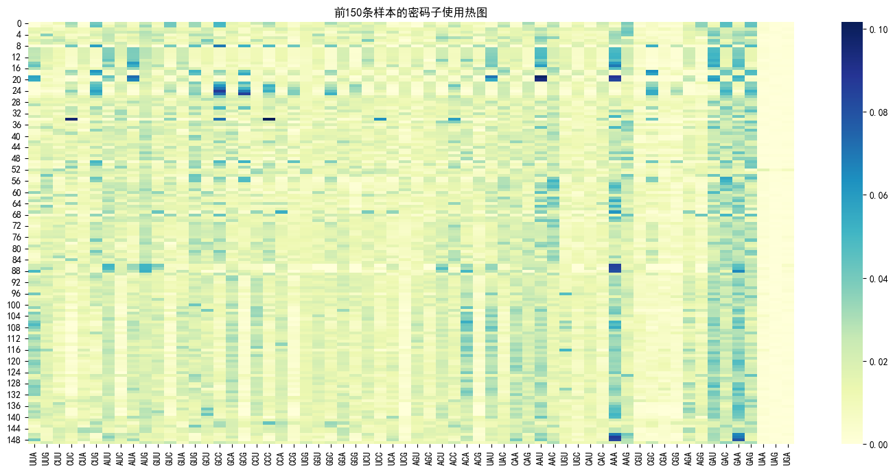
    


### 绘制每一种Kingdom对应的密码子使用频率热图

将前面计算出的每种kingdom类中不同密码子的使用频率绘制成热图


```python
plt.figure(figsize=(18, 8))
sns.heatmap(codon_by_kingdom, cmap="YlGnBu", annot=False)
plt.title("不同 Kingdom 的密码子平均使用频率热图")
plt.xlabel("密码子")
plt.ylabel("Kingdom")
plt.tight_layout()
plt.savefig(images_path+"Codons_Usage_Heat_Maps.png")
plt.show()

```


    
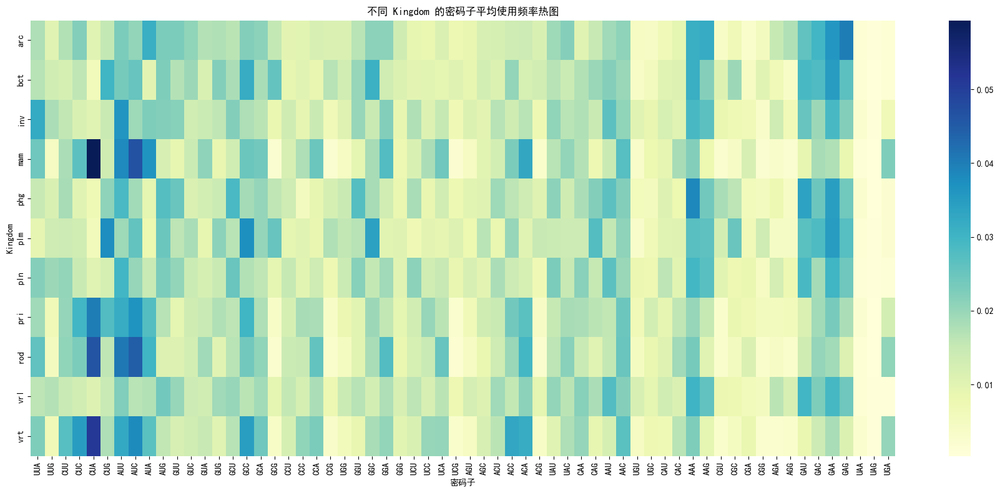
    


### 绘制所有Kingdom对应的密码子频率的条形图


```python
plt.figure(figsize=(12, 6))
sns.barplot(data=top_codons_long, x='Codon', y='Frequency', hue='Kingdom')
plt.title("各 Kingdom 最常用的前 5 个密码子频率")
plt.ylabel("平均使用频率")
plt.xlabel("密码子")
plt.legend(title="Kingdom")
plt.tight_layout()
plt.savefig(images_path+"Most_Used_Codons_For_All_kingdom.png")
plt.show()

```


    
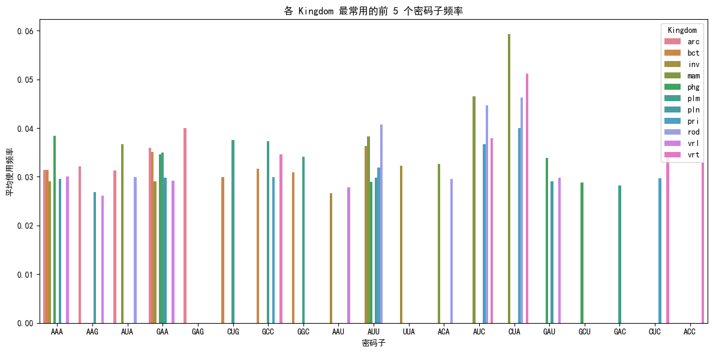
    


```python
# 创建 FacetGrid 条形图
g = sns.catplot(
    data=top_codons_long,
    x="Codon", y="Frequency",
    col="Kingdom", kind="bar",
    col_wrap=3, height=4, aspect=1
)

# 遍历每个子图（Axes），添加标签
for ax, (kingdom, group) in zip(g.axes.flatten(), top_codons_long.groupby("Kingdom")):
    for bar, codon in zip(ax.containers[0], group["Codon"]):
        height = bar.get_height()
        ax.text(
            bar.get_x() + bar.get_width() / 2, height + 0.001,
            codon, ha='center', va='bottom', fontsize=9, rotation=0
        )
    ax.set_xticklabels([])


# 设置标题与间距
g.fig.suptitle("每个 Kingdom 中最偏好的 5 个密码子", y=1.05)
g.set_titles("Kingdom: {col_name}")
plt.tight_layout()
plt.savefig(images_path+"Most_Used_Codons_For_Every_kingdom.png")
plt.show()
```


    
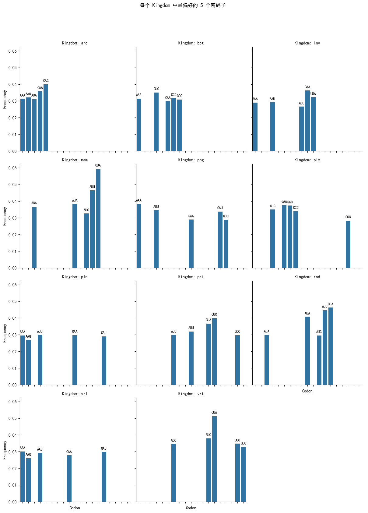
    


### 绘制不同Kingdom的GC含量的箱图


```python
# 绘制GC含量分布图
plt.figure(figsize=(10, 6))
sns.boxplot(data=df_with_codon, x='Kingdom', y='GC')
plt.title("不同 Kingdom 的 GC 含量分布")
plt.savefig(images_path+"GC_Content_In_Different_Kingdoms.png")
plt.show()
```


    
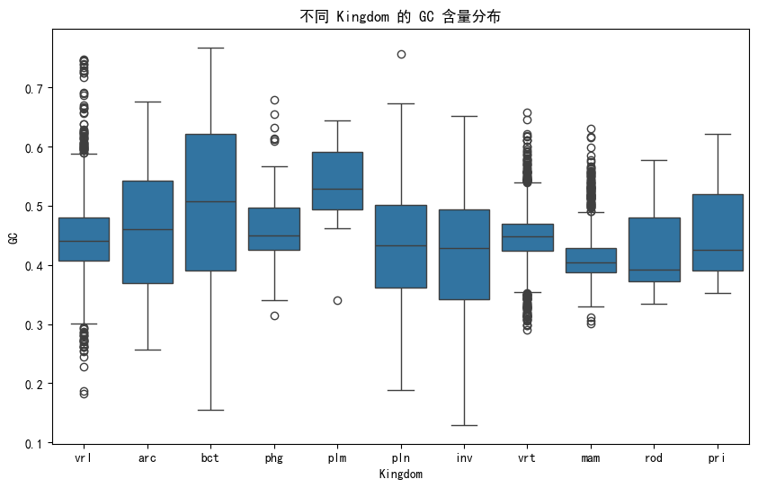
    


```python
# 定义用于可视化密码子出现频率的函数
def Visual_Codon_Freq(n, type):
    from sklearn.decomposition import PCA

    # 首先进行 PCA
    pca = PCA(n_components=n)# 定义PCA函数的参数
    p_codon_pca = pca.fit_transform(p_codon_scaled)

    # 定义输出图片的标题和文件名
    name_zh = f"PCA 可视化密码子频率（按 {type} 分类）"
    name_en = f"Visual_Codon_Freq_{type}.png"

    # 转换为 DataFrame
    pca_df = pd.DataFrame(data=p_codon_pca[:, :2], columns=['PC1', 'PC2'])
    pca_df[type] = df[type].values

    # 绘图
    plt.figure(figsize=(10, 6))
    sns.scatterplot(data=pca_df, x='PC1', y='PC2', hue=type, palette='Set2', s=50)
    plt.title(name_zh)
    plt.xlabel("主成分 1")
    plt.ylabel("主成分 2")
    plt.legend(title=type)
    plt.grid(True)
    plt.savefig(images_path + name_en)
    plt.show()

    print("各主成分贡献率（Kingdom）:")
    for i, var in enumerate(pca.explained_variance_ratio_[:5]):
        print(f"PC{i+1}: {var:.4f}")
```


```python
Visual_Codon_Freq(2, "Kingdom")
```


    
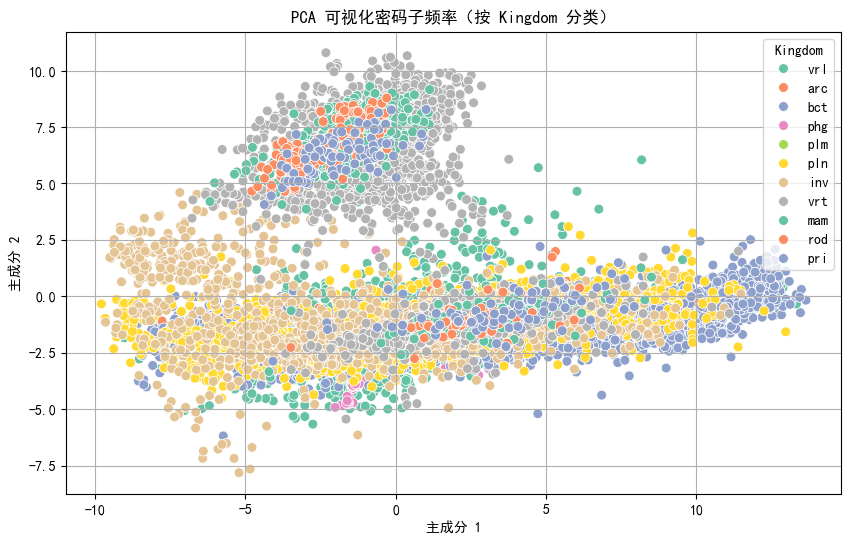
    


    各主成分贡献率（Kingdom）:
    PC1: 0.3079
    PC2: 0.1835
    


```python
Visual_Codon_Freq(2, "DNAtype")
```


    
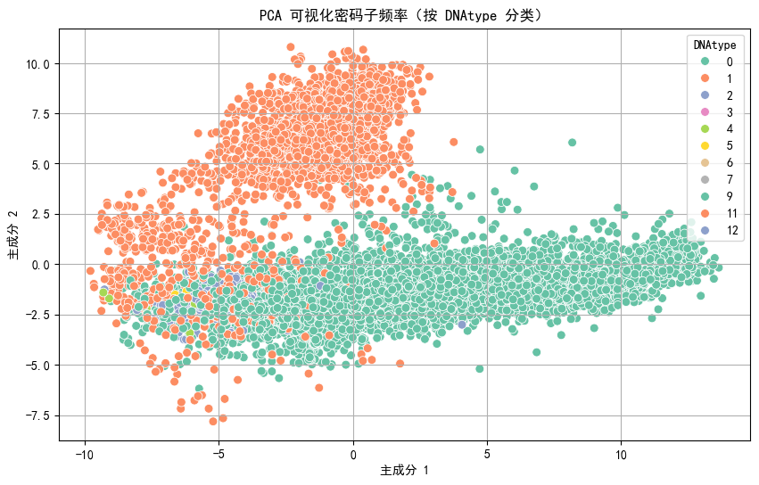
    


    各主成分贡献率（Kingdom）:
    PC1: 0.3079
    PC2: 0.1835
    


```python

```


```python
pca_full = PCA().fit(p_codon_scaled)
cumsum_var = pca_full.explained_variance_ratio_.cumsum()
num_components = len(cumsum_var)

plt.figure(figsize=(10, 6))
plt.plot(range(1, num_components + 1), cumsum_var, marker='o')
plt.xlabel("主成分数量")
plt.ylabel("累计解释方差")
plt.title("PCA 累计解释能力图")
plt.grid(True)
plt.show()
```


    
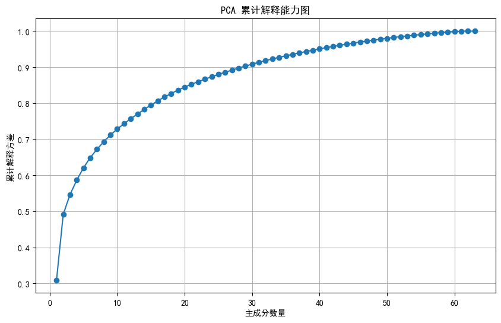
    


```python
def Visual_Codon_Freq_3D(n, type):
    # 执行 PCA
    pca = PCA(n_components=n)
    p_codon_pca = pca.fit_transform(p_codon_scaled)

    # 提取前3个主成分
    pca_df = pd.DataFrame(data=p_codon_pca[:, :3], columns=['PC1', 'PC2', 'PC3'])
    pca_df[type] = df[type].values

    # 计算解释方差比例
    explained = pca.explained_variance_ratio_[:3]
    total_var = explained.sum()

    # 绘图
    fig = plt.figure(figsize=(12, 8))
    ax = fig.add_subplot(111, projection='3d')
    
    # 为每一类绘制散点
    unique_labels = pca_df[type].unique()
    colors = plt.cm.get_cmap('Set2', len(unique_labels))

    for idx, label in enumerate(unique_labels):
        subset = pca_df[pca_df[type] == label]
        ax.scatter(subset['PC1'], subset['PC2'], subset['PC3'], 
                   label=label, color=colors(idx), s=40, alpha=0.8)

    ax.set_xlabel(f"PC1 ({explained[0]:.2%})")
    ax.set_ylabel(f"PC2 ({explained[1]:.2%})")
    ax.set_zlabel(f"PC3 ({explained[2]:.2%})")
    ax.set_title(f"PCA 三维可视化密码子频率（按 {type} 分类）\n前{n}主成分共解释 {total_var:.2%} 的方差")
    ax.legend(title=type)
    plt.tight_layout()

    # 保存图像
    filename = f"Visual_Codon_Freq_3D_{type}.png"
    plt.savefig(images_path + filename)
    plt.show()
```


```python
Visual_Codon_Freq_3D(10, "Kingdom")
Visual_Codon_Freq_3D(10, "DNAtype")
```

    C:\Users\bcg28\AppData\Local\Temp\ipykernel_21140\1903988109.py:20: MatplotlibDeprecationWarning: The get_cmap function was deprecated in Matplotlib 3.7 and will be removed in 3.11. Use ``matplotlib.colormaps[name]`` or ``matplotlib.colormaps.get_cmap()`` or ``pyplot.get_cmap()`` instead.
      colors = plt.cm.get_cmap('Set2', len(unique_labels))
    


    
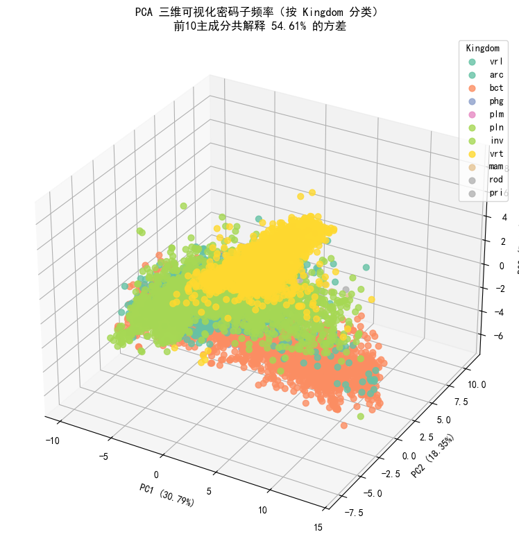
    


    C:\Users\bcg28\AppData\Local\Temp\ipykernel_21140\1903988109.py:20: MatplotlibDeprecationWarning: The get_cmap function was deprecated in Matplotlib 3.7 and will be removed in 3.11. Use ``matplotlib.colormaps[name]`` or ``matplotlib.colormaps.get_cmap()`` or ``pyplot.get_cmap()`` instead.
      colors = plt.cm.get_cmap('Set2', len(unique_labels))
    


    
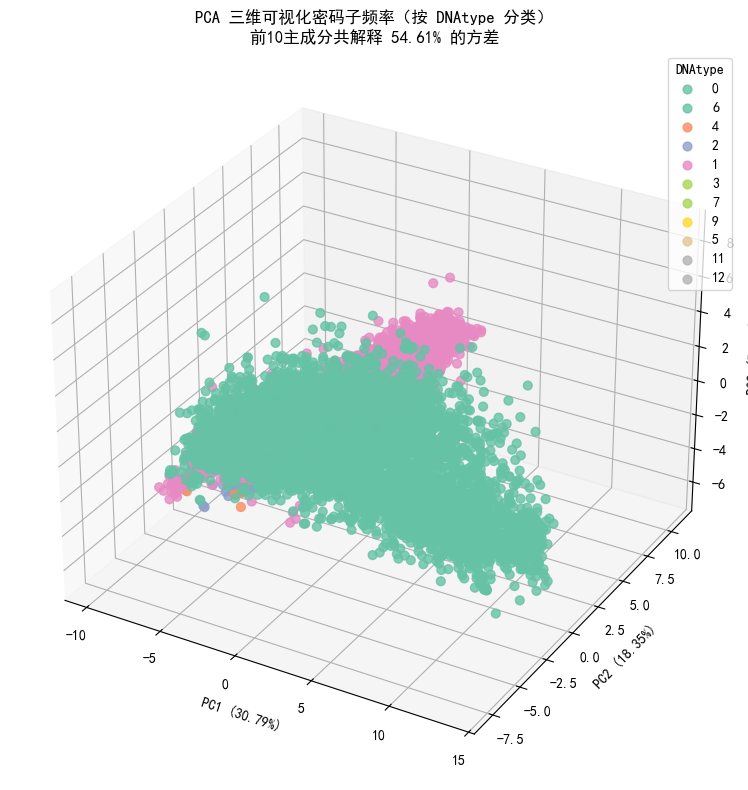
    


# 三、PCA与聚类分析

## 函数定义


```python
def Cluster_Codon_Freq_KMeans(n_components, n_clusters,type):
    # 1. PCA 降维
    pca = PCA(n_components=n_components)
    p_codon = pca.fit_transform(p_codon_scaled)
    # 2. KMeans 聚类
    kmeans = KMeans(n_clusters=n_clusters, random_state=42, n_init='auto')
    cluster_labels = kmeans.fit_predict(p_codon)

    # 3. 构造 DataFrame
    cluster_df = pd.DataFrame(p_codon[:, :2], columns=["PC1", "PC2"])
    cluster_df["Cluster"] = cluster_labels
    cluster_df[type] = df[type]  # 可对比实际分类

    # 4. 可视化
    plt.figure(figsize=(10, 6))
    sns.scatterplot(data=cluster_df, x="PC1", y="PC2", hue="Cluster", palette="Set1", s=50)
    plt.title("KMeans 聚类结果 ("+type+f",k={n_clusters}) on PCA({n_components})")
    plt.grid(True)
    plt.legend(title="聚类编号")
    filename="ResultsOfCluster_"+type+f"{n_clusters}"+f"{n_components}"+".png"
    plt.savefig(cluster_path + filename)
    plt.show()
    
    # 5. 可选：输出聚类对实际分类的交叉表
    print("\n "+type+"聚类 vs 实际 分类:")
    print(pd.crosstab(cluster_df["Cluster"], cluster_df[type]))

    sil_score = silhouette_score(p_codon, cluster_labels)
    nmi_score = normalized_mutual_info_score(df[type], cluster_labels)
    ari_score = adjusted_rand_score(df[type], cluster_labels)
    
    print(f"轮廓系数: {sil_score:.3f}")
    print(f"互信息(NMI): {nmi_score:.3f}")
    print(f"调整兰德指数(ARI): {ari_score:.3f}")
    
    df_plot = pd.DataFrame(p_codon[:, :2], columns=["PC1", "PC2"])
    df_plot["Cluster"] = cluster_labels
    df_plot["Kingdom"] = df["Kingdom"]
    
    plt.figure(figsize=(10, 6))
    sns.scatterplot(data=df_plot, x="PC1", y="PC2", hue="Cluster", style="Kingdom", palette="tab10")
    plt.title("PCA 二维聚类结果 vs Kingdom")
    plt.legend(bbox_to_anchor=(1.05, 1), loc='upper left')
    plt.grid(True)
    plt.tight_layout()
    plt.show()
```

### 确定最佳聚类数


```python
def Find_Optimal_K(n_components=10, k_range=range(1, 11)):
    pca = PCA(n_components=n_components)
    codon_pca = pca.fit_transform(p_codon_scaled)

    inertias = []
    for k in k_range:
        kmeans = KMeans(n_clusters=k, random_state=42, n_init='auto')
        kmeans.fit(codon_pca)
        inertias.append(kmeans.inertia_)

    plt.figure(figsize=(8, 5))
    plt.plot(k_range, inertias, marker='o')
    plt.title("肘部法则 - 寻找最佳聚类数 k")
    plt.xlabel("聚类数 k")
    plt.ylabel("组内平方和 (Inertia)")
    plt.grid(True)
    filename="ElbowRule.png"
    plt.savefig(cluster_path + filename)
    plt.show()
```


```python
Find_Optimal_K(n_components=10, k_range=range(1, 10))
```


    
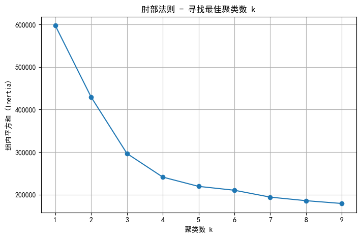
    


## 聚类分析

### 对Kingdom进行聚类分析


```python
Cluster_Codon_Freq_KMeans(10,3,"Kingdom")# 输出Kingdom类进行聚类后的结果
Cluster_Codon_Freq_KMeans(10,4,"Kingdom")
Cluster_Codon_Freq_KMeans(10,5,"Kingdom")
```


    

    


    
     Kingdom聚类 vs 实际 分类:
    Kingdom  arc   bct  inv  mam  phg  plm   pln  pri  rod   vrl   vrt
    Cluster                                                           
    0         55  1542  382   82   55   13   680   69   50   477   316
    1          0     0   48  467    0    0     0   97  156    12  1596
    2         71  1378  915   23  165    5  1843   14    9  2343   165
    轮廓系数: 0.351
    互信息(NMI): 0.261
    调整兰德指数(ARI): 0.165
    


    
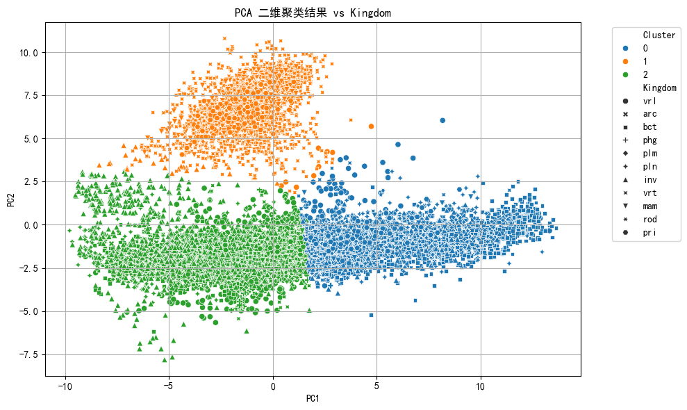
    


    

    


    
     Kingdom聚类 vs 实际 分类:
    Kingdom  arc   bct  inv  mam  phg  plm   pln  pri  rod   vrl   vrt
    Cluster                                                           
    0         30  1271  103   14   23    7   241   20    6   128    38
    1          0     0   39  467    0    0     0   97  156     8  1594
    2         43  1054  576    3   90    1  1177    1    1   835    18
    3         53   595  627   88  107   10  1105   62   52  1861   427
    轮廓系数: 0.301
    互信息(NMI): 0.274
    调整兰德指数(ARI): 0.172
    


    

    


    

    


    
     Kingdom聚类 vs 实际 分类:
    Kingdom  arc   bct  inv  mam  phg  plm  pln  pri  rod   vrl   vrt
    Cluster                                                          
    0         20  1142   54    4   14    6  128    6    0    58    12
    1          0     0   36  466    0    0    0   97  156     5  1586
    2         28   701  433    4   39    1  928    0    0   269     6
    3         38   624  414    7  119    2  804    8    3  1803   103
    4         40   453  408   91   48    9  663   69   56   697   370
    轮廓系数: 0.254
    互信息(NMI): 0.281
    调整兰德指数(ARI): 0.192
    


    
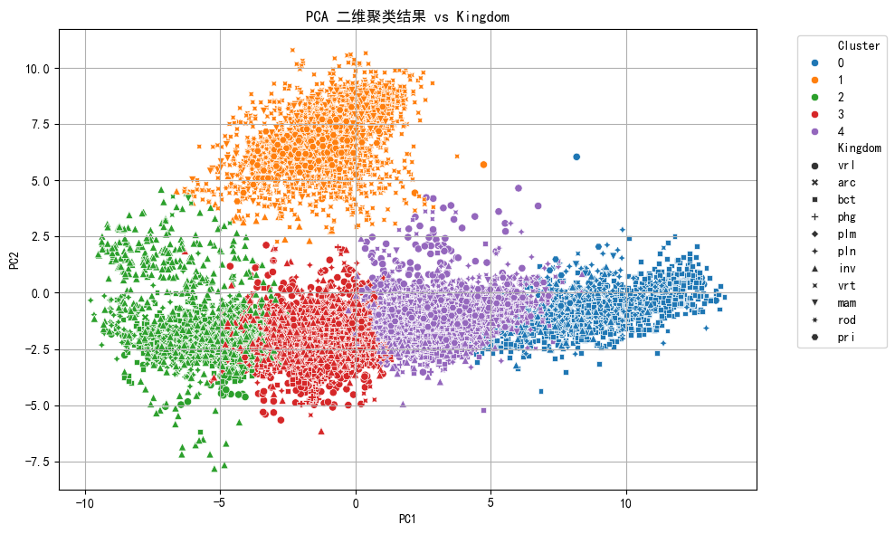
    


### 对DNAtype进行聚类分析


```python
Cluster_Codon_Freq_KMeans(10,3,"DNAtype")# 输出Kingdom类进行聚类后的结果
Cluster_Codon_Freq_KMeans(10,4,"DNAtype")
Cluster_Codon_Freq_KMeans(10,5,"DNAtype")
```


    
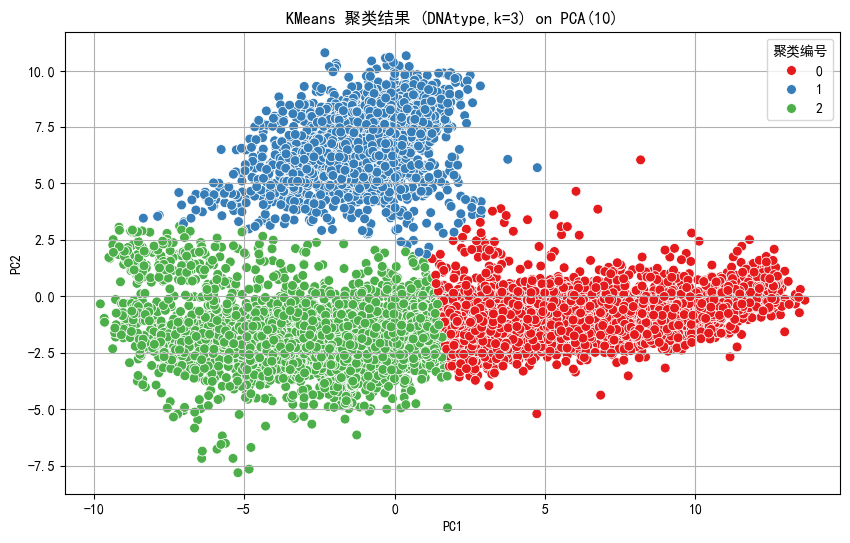
    


    
     DNAtype聚类 vs 实际 分类:
    DNAtype    0     1    2   3   4   5   6   7   9   11  12
    Cluster                                                 
    0        3711     6    0   0   2   0   0   0   1   0   1
    1          14  2362    0   0   0   0   0   0   0   0   0
    2        5542   531  816   2  29   2   1   1   1   2   4
    轮廓系数: 0.351
    互信息(NMI): 0.458
    调整兰德指数(ARI): 0.304
    


    

    


    
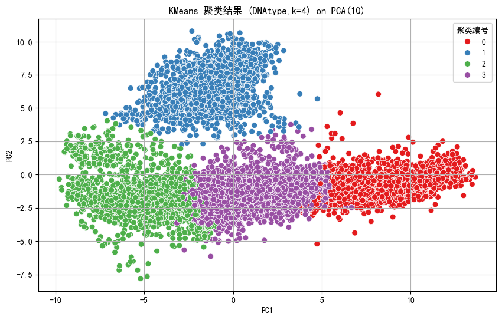
    


    
     DNAtype聚类 vs 实际 分类:
    DNAtype    0     1    2   3   4   5   6   7   9   11  12
    Cluster                                                 
    0        1880     0    0   0   0   0   0   0   1   0   0
    1           9  2352    0   0   0   0   0   0   0   0   0
    2        2442   508  811   2  27   2   1   1   0   2   3
    3        4936    39    5   0   4   0   0   0   1   0   2
    轮廓系数: 0.301
    互信息(NMI): 0.450
    调整兰德指数(ARI): 0.297
    


    
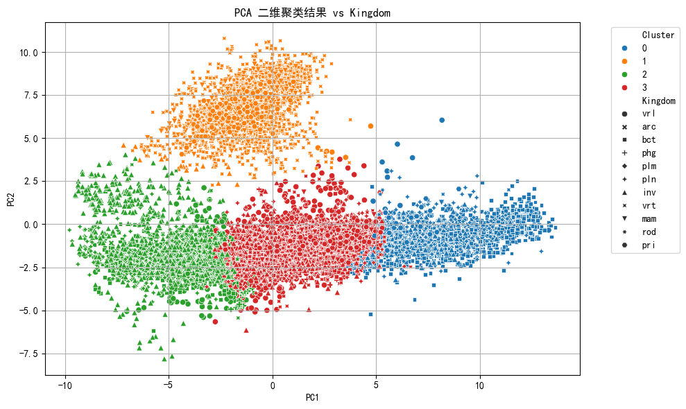
    


    
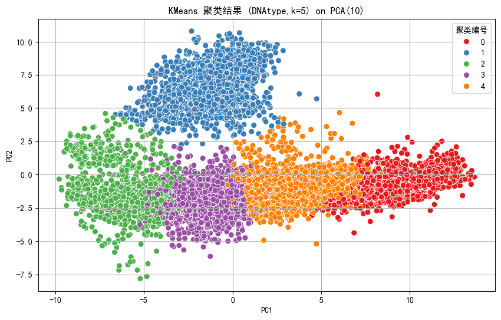
    


    
     DNAtype聚类 vs 实际 分类:
    DNAtype    0     1    2   3   4   5   6   7   9   11  12
    Cluster                                                 
    0        1444     0    0   0   0   0   0   0   0   0   0
    1           6  2340    0   0   0   0   0   0   0   0   0
    2        1154   461  760   1  25   2   0   1   0   2   3
    3        3780    83   55   1   4   0   1   0   0   0   1
    4        2883    15    1   0   2   0   0   0   2   0   1
    轮廓系数: 0.254
    互信息(NMI): 0.426
    调整兰德指数(ARI): 0.253
    


    

    


### 绘制聚类族群图


```python
def Plot_Hierarchical_Dendrogram(n_components=5, method='ward'):
    # 1. PCA 降维
    pca = PCA(n_components=n_components)
    codon_pca = pca.fit_transform(p_codon_scaled)
    # 为每个样本生成代号
    short_labels = [f"K{i}" for i in range(len(df))]
    label_map = dict(zip(short_labels, df['Kingdom']))
    
    # 进行聚类并绘图
    linked = linkage(codon_pca, method='ward')
    
    plt.figure(figsize=(14, 6))
    dendrogram(linked,
               labels=short_labels,  # 使用代号
               leaf_rotation=90,
               leaf_font_size=8,
               color_threshold=0.7 * max(linked[:, 2]))
    plt.title("树状图（使用缩写标签）")
    plt.xlabel("样本编号")
    plt.ylabel("距离")
    plt.tight_layout()
    plt.show()
    
    # 输出对照表
    print("样本标签对照表（缩写 → Kingdom）:")
    for code, kingdom in list(label_map.items())[:10]:  # 仅显示前10个
        print(f"{code} : {kingdom}")
```


```python
Plot_Hierarchical_Dendrogram(n_components=5, method='ward')
```


    
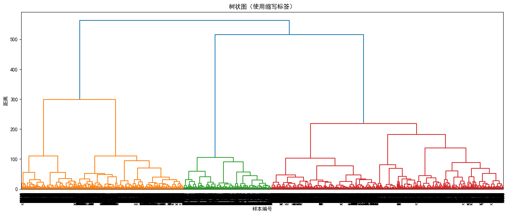
    


    样本标签对照表（缩写 → Kingdom）:
    K0 : vrl
    K1 : vrl
    K2 : vrl
    K3 : vrl
    K4 : vrl
    K5 : vrl
    K6 : vrl
    K7 : vrl
    K8 : vrl
    K9 : vrl
    

## 理论与结果分析

### 理论分析：
为了能够更好的判断聚类之后的结果是否具有生物进化意义，分别对Kingdom和DNAtype类进行不同族群数量的聚类，根据聚类的结果分析以下的几个指标

1. 聚类是否和实际标签高度一致（“纯度”高）
比如：某个聚类主要只对应一个 Kingdom（例如 cluster 1 → 主要为 mam, rod, vrt），就说明该聚类分得较有生物学意义。
如果聚类中混合了很多类别，说明区分度低。
2. 类别是否生物学上接近
如果前面聚类结果中的相近类别在生物学上确实更接近（如：mammal/rodent/primates），这可能反映出密码子偏好在系统发生上的连续性。
3. 是否揭示了 DNAtype 的演化趋势
某些 DNA 类型（如线粒体 vs 核 DNA）具有不同密码子偏好，聚类能区分它们，说明模型有能力反映这一差异。

### 指标计算
1. Silhouette Score（轮廓系数）：衡量每个样本距离本类和最近其他类的平均差值，越接近 1 越好，能够说明簇内紧凑、簇间分离；
2. NMI（Normalized Mutual Information）与ARI（Adjusted Rand Index）：用于衡量聚类标签与真实标签（Kingdom/DNAtype）的一致性（越高越好）


### 结果分析
#### Kingdom聚类结果分析
首先是对Kingdom的聚类结果

古细菌'arc'(archaea), 细菌'bct'(bacteria), 噬菌体'phg'(bacteriophage), 质粒'plm' (plasmid),植物 'pln' (plant), 无脊椎动物'inv' (invertebrate), 脊椎动物'vrt' (vertebrate), 哺乳动物'mam' (mammal),啮齿动物 'rod' (rodent), 灵长类动物'pri' (primate), 病毒'vrl'(virus)
1. 聚类数=3 
| Kingdom   | arc | bct  | inv | mam | phg | plm | pln  | pri | rod | vrl  | vrt  |
| --------- | --- | ---- | --- | --- | --- | --- | ---- | --- | --- | ---- | ---- |
| Cluster 0 | 55  | 1542 | 382 | 82  | 55  | 13  | 680  | 69  | 50  | 477  | 316  |
| Cluster 1 | 0   | 0    | 48  | 467 | 0   | 0   | 0    | 97  | 156 | 12   | 1596 |
| Cluster 2 | 71  | 1378 | 915 | 23  | 165 | 5   | 1843 | 14  | 9   | 2343 | 165  |

轮廓系数: 0.351

互信息(NMI): 0.261

调整兰德指数(ARI): 0.165

2. 聚类数=4 Kingdom聚类 vs 实际 分类:
| Kingdom   | arc | bct  | inv | mam | phg | plm | pln  | pri | rod | vrl  | vrt  |
| --------- | --- | ---- | --- | --- | --- | --- | ---- | --- | --- | ---- | ---- |
| Cluster 0 | 30  | 1271 | 103 | 14  | 23  | 7   | 241  | 20  | 6   | 128  | 38   |
| Cluster 1 | 0   | 0    | 39  | 467 | 0   | 0   | 0    | 97  | 156 | 8    | 1594 |
| Cluster 2 | 43  | 1054 | 576 | 3   | 90  | 1   | 1177 | 1   | 1   | 835  | 18   |
| Cluster 3 | 53  | 595  | 627 | 88  | 107 | 10  | 1105 | 62  | 52  | 1861 | 427  |

轮廓系数: 0.301

互信息(NMI): 0.274

调整兰德指数(ARI): 0.172

3. 聚类数=5 Kingdom聚类 vs 实际 分类:
| Kingdom   | arc | bct  | inv | mam | phg | plm | pln | pri | rod | vrl  | vrt  |
| --------- | --- | ---- | --- | --- | --- | --- | --- | --- | --- | ---- | ---- |
| Cluster 0 | 20  | 1142 | 54  | 4   | 14  | 6   | 128 | 6   | 0   | 58   | 12   |
| Cluster 1 | 0   | 0    | 36  | 466 | 0   | 0   | 0   | 97  | 156 | 5    | 1586 |
| Cluster 2 | 28  | 701  | 433 | 4   | 39  | 1   | 928 | 0   | 0   | 269  | 6    |
| Cluster 3 | 38  | 624  | 414 | 7   | 119 | 2   | 804 | 8   | 3   | 1803 | 103  |
| Cluster 4 | 40  | 453  | 408 | 91  | 48  | 9   | 663 | 69  | 56  | 697  | 370  |

轮廓系数: 0.254

互信息(NMI): 0.281

调整兰德指数(ARI): 0.192

根据以上的结果我们可以判断聚类数为3时能够更清楚地区分出原核/植物、哺乳类群、病毒群


#### DNAtype聚类结果分析

基因组0-genomic, 线粒体1-mitochondrial, 叶绿体2-chloroplast, 叶绿体拟核体3-cyanelle, 质体4-plastid, 核内体5-nucleomorph, 次级内共生体6-secondary_endosymbiont, 有色体7-chromoplast, 白色体8-leucoplast, 无9-NA, 前质体10-proplastid, 顶体11-apicoplast, and 动物基体12-kinetoplast
1. 聚类数 = 4, DNAtype聚类 vs 实际 分类:
| DNAtype   | 0    | 1    | 2   | 3 | 4  | 5 | 6 | 7 | 9 | 11 | 12 |
| --------- | ---- | ---- | --- | - | -- | - | - | - | - | -- | -- |
| Cluster 0 | 3711 | 6    | 0   | 0 | 2  | 0 | 0 | 0 | 1 | 0  | 1  |
| Cluster 1 | 14   | 2362 | 0   | 0 | 0  | 0 | 0 | 0 | 0 | 0  | 0  |
| Cluster 2 | 5542 | 531  | 816 | 2 | 29 | 2 | 1 | 1 | 1 | 2  | 4  |

轮廓系数: 0.351

互信息(NMI): 0.458

调整兰德指数(ARI): 0.304

2. 聚类数 = 4，DNAtype 聚类 vs 实际分类
| DNAtype   | 0    | 1    | 2   | 3 | 4  | 5 | 6 | 7 | 9 | 11 | 12 |
| --------- | ---- | ---- | --- | - | -- | - | - | - | - | -- | -- |
| Cluster 0 | 1880 | 0    | 0   | 0 | 0  | 0 | 0 | 0 | 1 | 0  | 0  |
| Cluster 1 | 9    | 2352 | 0   | 0 | 0  | 0 | 0 | 0 | 0 | 0  | 0  |
| Cluster 2 | 2442 | 508  | 811 | 2 | 27 | 2 | 1 | 1 | 0 | 2  | 3  |
| Cluster 3 | 4936 | 39   | 5   | 0 | 4  | 0 | 0 | 0 | 1 | 0  | 2  |

轮廓系数: 0.301

互信息(NMI): 0.450

调整兰德指数(ARI): 0.297

3. 聚类数 = 5，DNAtype 聚类 vs 实际分类
| DNAtype   | 0    | 1    | 2   | 3 | 4  | 5 | 6 | 7 | 9 | 11 | 12 |
| --------- | ---- | ---- | --- | - | -- | - | - | - | - | -- | -- |
| Cluster 0 | 1444 | 0    | 0   | 0 | 0  | 0 | 0 | 0 | 0 | 0  | 0  |
| Cluster 1 | 6    | 2340 | 0   | 0 | 0  | 0 | 0 | 0 | 0 | 0  | 0  |
| Cluster 2 | 1154 | 461  | 760 | 1 | 25 | 2 | 0 | 1 | 0 | 2  | 3  |
| Cluster 3 | 3780 | 83   | 55  | 1 | 4  | 0 | 1 | 0 | 0 | 0  | 1  |
| Cluster 4 | 2883 | 15   | 1   | 0 | 2  | 0 | 0 | 0 | 2 | 0  | 1  |

轮廓系数: 0.254

互信息(NMI): 0.426

调整兰德指数(ARI): 0.253

根据以上的结果我们可以判断聚类数为3时能够更清楚地区分出核DNA和线粒体

# 四、随机森林分类模型：Kingdom 分类

## 模型构建


```python
# 找出仍然存在的非数值列
non_numeric_cols = X.select_dtypes(include=['object']).columns
print("非数值列有：", non_numeric_cols.tolist())

```

    非数值列有： ['UUU', 'UUC']
    


```python
# 按 80% 训练 / 20% 测试划分数据
X_train, X_test, y_train, y_test = train_test_split(X_clean, y_encoded, test_size=0.2, random_state=42, stratify=y_encoded)
# 构建模型
model = RandomForestClassifier(n_estimators=100, random_state=42)
model.fit(X_train, y_train)

```


<style>#sk-container-id-1 {
  /* Definition of color scheme common for light and dark mode */
  --sklearn-color-text: #000;
  --sklearn-color-text-muted: #666;
  --sklearn-color-line: gray;
  /* Definition of color scheme for unfitted estimators */
  --sklearn-color-unfitted-level-0: #fff5e6;
  --sklearn-color-unfitted-level-1: #f6e4d2;
  --sklearn-color-unfitted-level-2: #ffe0b3;
  --sklearn-color-unfitted-level-3: chocolate;
  /* Definition of color scheme for fitted estimators */
  --sklearn-color-fitted-level-0: #f0f8ff;
  --sklearn-color-fitted-level-1: #d4ebff;
  --sklearn-color-fitted-level-2: #b3dbfd;
  --sklearn-color-fitted-level-3: cornflowerblue;

  /* Specific color for light theme */
  --sklearn-color-text-on-default-background: var(--sg-text-color, var(--theme-code-foreground, var(--jp-content-font-color1, black)));
  --sklearn-color-background: var(--sg-background-color, var(--theme-background, var(--jp-layout-color0, white)));
  --sklearn-color-border-box: var(--sg-text-color, var(--theme-code-foreground, var(--jp-content-font-color1, black)));
  --sklearn-color-icon: #696969;

  @media (prefers-color-scheme: dark) {
    /* Redefinition of color scheme for dark theme */
    --sklearn-color-text-on-default-background: var(--sg-text-color, var(--theme-code-foreground, var(--jp-content-font-color1, white)));
    --sklearn-color-background: var(--sg-background-color, var(--theme-background, var(--jp-layout-color0, #111)));
    --sklearn-color-border-box: var(--sg-text-color, var(--theme-code-foreground, var(--jp-content-font-color1, white)));
    --sklearn-color-icon: #878787;
  }
}

#sk-container-id-1 {
  color: var(--sklearn-color-text);
}

#sk-container-id-1 pre {
  padding: 0;
}

#sk-container-id-1 input.sk-hidden--visually {
  border: 0;
  clip: rect(1px 1px 1px 1px);
  clip: rect(1px, 1px, 1px, 1px);
  height: 1px;
  margin: -1px;
  overflow: hidden;
  padding: 0;
  position: absolute;
  width: 1px;
}

#sk-container-id-1 div.sk-dashed-wrapped {
  border: 1px dashed var(--sklearn-color-line);
  margin: 0 0.4em 0.5em 0.4em;
  box-sizing: border-box;
  padding-bottom: 0.4em;
  background-color: var(--sklearn-color-background);
}

#sk-container-id-1 div.sk-container {
  /* jupyter's `normalize.less` sets `[hidden] { display: none; }`
     but bootstrap.min.css set `[hidden] { display: none !important; }`
     so we also need the `!important` here to be able to override the
     default hidden behavior on the sphinx rendered scikit-learn.org.
     See: https://github.com/scikit-learn/scikit-learn/issues/21755 */
  display: inline-block !important;
  position: relative;
}

#sk-container-id-1 div.sk-text-repr-fallback {
  display: none;
}

div.sk-parallel-item,
div.sk-serial,
div.sk-item {
  /* draw centered vertical line to link estimators */
  background-image: linear-gradient(var(--sklearn-color-text-on-default-background), var(--sklearn-color-text-on-default-background));
  background-size: 2px 100%;
  background-repeat: no-repeat;
  background-position: center center;
}

/* Parallel-specific style estimator block */

#sk-container-id-1 div.sk-parallel-item::after {
  content: "";
  width: 100%;
  border-bottom: 2px solid var(--sklearn-color-text-on-default-background);
  flex-grow: 1;
}

#sk-container-id-1 div.sk-parallel {
  display: flex;
  align-items: stretch;
  justify-content: center;
  background-color: var(--sklearn-color-background);
  position: relative;
}

#sk-container-id-1 div.sk-parallel-item {
  display: flex;
  flex-direction: column;
}

#sk-container-id-1 div.sk-parallel-item:first-child::after {
  align-self: flex-end;
  width: 50%;
}

#sk-container-id-1 div.sk-parallel-item:last-child::after {
  align-self: flex-start;
  width: 50%;
}

#sk-container-id-1 div.sk-parallel-item:only-child::after {
  width: 0;
}

/* Serial-specific style estimator block */

#sk-container-id-1 div.sk-serial {
  display: flex;
  flex-direction: column;
  align-items: center;
  background-color: var(--sklearn-color-background);
  padding-right: 1em;
  padding-left: 1em;
}


/* Toggleable style: style used for estimator/Pipeline/ColumnTransformer box that is
clickable and can be expanded/collapsed.
- Pipeline and ColumnTransformer use this feature and define the default style
- Estimators will overwrite some part of the style using the `sk-estimator` class
*/

/* Pipeline and ColumnTransformer style (default) */

#sk-container-id-1 div.sk-toggleable {
  /* Default theme specific background. It is overwritten whether we have a
  specific estimator or a Pipeline/ColumnTransformer */
  background-color: var(--sklearn-color-background);
}

/* Toggleable label */
#sk-container-id-1 label.sk-toggleable__label {
  cursor: pointer;
  display: flex;
  width: 100%;
  margin-bottom: 0;
  padding: 0.5em;
  box-sizing: border-box;
  text-align: center;
  align-items: start;
  justify-content: space-between;
  gap: 0.5em;
}

#sk-container-id-1 label.sk-toggleable__label .caption {
  font-size: 0.6rem;
  font-weight: lighter;
  color: var(--sklearn-color-text-muted);
}

#sk-container-id-1 label.sk-toggleable__label-arrow:before {
  /* Arrow on the left of the label */
  content: "▸";
  float: left;
  margin-right: 0.25em;
  color: var(--sklearn-color-icon);
}

#sk-container-id-1 label.sk-toggleable__label-arrow:hover:before {
  color: var(--sklearn-color-text);
}

/* Toggleable content - dropdown */

#sk-container-id-1 div.sk-toggleable__content {
  display: none;
  text-align: left;
  /* unfitted */
  background-color: var(--sklearn-color-unfitted-level-0);
}

#sk-container-id-1 div.sk-toggleable__content.fitted {
  /* fitted */
  background-color: var(--sklearn-color-fitted-level-0);
}

#sk-container-id-1 div.sk-toggleable__content pre {
  margin: 0.2em;
  border-radius: 0.25em;
  color: var(--sklearn-color-text);
  /* unfitted */
  background-color: var(--sklearn-color-unfitted-level-0);
}

#sk-container-id-1 div.sk-toggleable__content.fitted pre {
  /* unfitted */
  background-color: var(--sklearn-color-fitted-level-0);
}

#sk-container-id-1 input.sk-toggleable__control:checked~div.sk-toggleable__content {
  /* Expand drop-down */
  display: block;
  width: 100%;
  overflow: visible;
}

#sk-container-id-1 input.sk-toggleable__control:checked~label.sk-toggleable__label-arrow:before {
  content: "▾";
}

/* Pipeline/ColumnTransformer-specific style */

#sk-container-id-1 div.sk-label input.sk-toggleable__control:checked~label.sk-toggleable__label {
  color: var(--sklearn-color-text);
  background-color: var(--sklearn-color-unfitted-level-2);
}

#sk-container-id-1 div.sk-label.fitted input.sk-toggleable__control:checked~label.sk-toggleable__label {
  background-color: var(--sklearn-color-fitted-level-2);
}

/* Estimator-specific style */

/* Colorize estimator box */
#sk-container-id-1 div.sk-estimator input.sk-toggleable__control:checked~label.sk-toggleable__label {
  /* unfitted */
  background-color: var(--sklearn-color-unfitted-level-2);
}

#sk-container-id-1 div.sk-estimator.fitted input.sk-toggleable__control:checked~label.sk-toggleable__label {
  /* fitted */
  background-color: var(--sklearn-color-fitted-level-2);
}

#sk-container-id-1 div.sk-label label.sk-toggleable__label,
#sk-container-id-1 div.sk-label label {
  /* The background is the default theme color */
  color: var(--sklearn-color-text-on-default-background);
}

/* On hover, darken the color of the background */
#sk-container-id-1 div.sk-label:hover label.sk-toggleable__label {
  color: var(--sklearn-color-text);
  background-color: var(--sklearn-color-unfitted-level-2);
}

/* Label box, darken color on hover, fitted */
#sk-container-id-1 div.sk-label.fitted:hover label.sk-toggleable__label.fitted {
  color: var(--sklearn-color-text);
  background-color: var(--sklearn-color-fitted-level-2);
}

/* Estimator label */

#sk-container-id-1 div.sk-label label {
  font-family: monospace;
  font-weight: bold;
  display: inline-block;
  line-height: 1.2em;
}

#sk-container-id-1 div.sk-label-container {
  text-align: center;
}

/* Estimator-specific */
#sk-container-id-1 div.sk-estimator {
  font-family: monospace;
  border: 1px dotted var(--sklearn-color-border-box);
  border-radius: 0.25em;
  box-sizing: border-box;
  margin-bottom: 0.5em;
  /* unfitted */
  background-color: var(--sklearn-color-unfitted-level-0);
}

#sk-container-id-1 div.sk-estimator.fitted {
  /* fitted */
  background-color: var(--sklearn-color-fitted-level-0);
}

/* on hover */
#sk-container-id-1 div.sk-estimator:hover {
  /* unfitted */
  background-color: var(--sklearn-color-unfitted-level-2);
}

#sk-container-id-1 div.sk-estimator.fitted:hover {
  /* fitted */
  background-color: var(--sklearn-color-fitted-level-2);
}

/* Specification for estimator info (e.g. "i" and "?") */

/* Common style for "i" and "?" */

.sk-estimator-doc-link,
a:link.sk-estimator-doc-link,
a:visited.sk-estimator-doc-link {
  float: right;
  font-size: smaller;
  line-height: 1em;
  font-family: monospace;
  background-color: var(--sklearn-color-background);
  border-radius: 1em;
  height: 1em;
  width: 1em;
  text-decoration: none !important;
  margin-left: 0.5em;
  text-align: center;
  /* unfitted */
  border: var(--sklearn-color-unfitted-level-1) 1pt solid;
  color: var(--sklearn-color-unfitted-level-1);
}

.sk-estimator-doc-link.fitted,
a:link.sk-estimator-doc-link.fitted,
a:visited.sk-estimator-doc-link.fitted {
  /* fitted */
  border: var(--sklearn-color-fitted-level-1) 1pt solid;
  color: var(--sklearn-color-fitted-level-1);
}

/* On hover */
div.sk-estimator:hover .sk-estimator-doc-link:hover,
.sk-estimator-doc-link:hover,
div.sk-label-container:hover .sk-estimator-doc-link:hover,
.sk-estimator-doc-link:hover {
  /* unfitted */
  background-color: var(--sklearn-color-unfitted-level-3);
  color: var(--sklearn-color-background);
  text-decoration: none;
}

div.sk-estimator.fitted:hover .sk-estimator-doc-link.fitted:hover,
.sk-estimator-doc-link.fitted:hover,
div.sk-label-container:hover .sk-estimator-doc-link.fitted:hover,
.sk-estimator-doc-link.fitted:hover {
  /* fitted */
  background-color: var(--sklearn-color-fitted-level-3);
  color: var(--sklearn-color-background);
  text-decoration: none;
}

/* Span, style for the box shown on hovering the info icon */
.sk-estimator-doc-link span {
  display: none;
  z-index: 9999;
  position: relative;
  font-weight: normal;
  right: .2ex;
  padding: .5ex;
  margin: .5ex;
  width: min-content;
  min-width: 20ex;
  max-width: 50ex;
  color: var(--sklearn-color-text);
  box-shadow: 2pt 2pt 4pt #999;
  /* unfitted */
  background: var(--sklearn-color-unfitted-level-0);
  border: .5pt solid var(--sklearn-color-unfitted-level-3);
}

.sk-estimator-doc-link.fitted span {
  /* fitted */
  background: var(--sklearn-color-fitted-level-0);
  border: var(--sklearn-color-fitted-level-3);
}

.sk-estimator-doc-link:hover span {
  display: block;
}

/* "?"-specific style due to the `<a>` HTML tag */

#sk-container-id-1 a.estimator_doc_link {
  float: right;
  font-size: 1rem;
  line-height: 1em;
  font-family: monospace;
  background-color: var(--sklearn-color-background);
  border-radius: 1rem;
  height: 1rem;
  width: 1rem;
  text-decoration: none;
  /* unfitted */
  color: var(--sklearn-color-unfitted-level-1);
  border: var(--sklearn-color-unfitted-level-1) 1pt solid;
}

#sk-container-id-1 a.estimator_doc_link.fitted {
  /* fitted */
  border: var(--sklearn-color-fitted-level-1) 1pt solid;
  color: var(--sklearn-color-fitted-level-1);
}

/* On hover */
#sk-container-id-1 a.estimator_doc_link:hover {
  /* unfitted */
  background-color: var(--sklearn-color-unfitted-level-3);
  color: var(--sklearn-color-background);
  text-decoration: none;
}

#sk-container-id-1 a.estimator_doc_link.fitted:hover {
  /* fitted */
  background-color: var(--sklearn-color-fitted-level-3);
}

.estimator-table summary {
    padding: .5rem;
    font-family: monospace;
    cursor: pointer;
}

.estimator-table details[open] {
    padding-left: 0.1rem;
    padding-right: 0.1rem;
    padding-bottom: 0.3rem;
}

.estimator-table .parameters-table {
    margin-left: auto !important;
    margin-right: auto !important;
}

.estimator-table .parameters-table tr:nth-child(odd) {
    background-color: #fff;
}

.estimator-table .parameters-table tr:nth-child(even) {
    background-color: #f6f6f6;
}

.estimator-table .parameters-table tr:hover {
    background-color: #e0e0e0;
}

.estimator-table table td {
    border: 1px solid rgba(106, 105, 104, 0.232);
}

.user-set td {
    color:rgb(255, 94, 0);
    text-align: left;
}

.user-set td.value pre {
    color:rgb(255, 94, 0) !important;
    background-color: transparent !important;
}

.default td {
    color: black;
    text-align: left;
}

.user-set td i,
.default td i {
    color: black;
}

.copy-paste-icon {
    background-image: url();
    background-repeat: no-repeat;
    background-size: 14px 14px;
    background-position: 0;
    display: inline-block;
    width: 14px;
    height: 14px;
    cursor: pointer;
}
</style><body><div id="sk-container-id-1" class="sk-top-container"><div class="sk-text-repr-fallback"><pre>RandomForestClassifier(random_state=42)</pre><b>In a Jupyter environment, please rerun this cell to show the HTML representation or trust the notebook. <br />On GitHub, the HTML representation is unable to render, please try loading this page with nbviewer.org.</b></div><div class="sk-container" hidden><div class="sk-item"><div class="sk-estimator fitted sk-toggleable"><input class="sk-toggleable__control sk-hidden--visually" id="sk-estimator-id-1" type="checkbox" checked><label for="sk-estimator-id-1" class="sk-toggleable__label fitted sk-toggleable__label-arrow"><div><div>RandomForestClassifier</div></div><div><a class="sk-estimator-doc-link fitted" rel="noreferrer" target="_blank" href="https://scikit-learn.org/1.7/modules/generated/sklearn.ensemble.RandomForestClassifier.html">?<span>Documentation for RandomForestClassifier</span></a><span class="sk-estimator-doc-link fitted">i<span>Fitted</span></span></div></label><div class="sk-toggleable__content fitted" data-param-prefix="">
        <div class="estimator-table">
            <details>
                <summary>Parameters</summary>
                <table class="parameters-table">
                  <tbody>

        <tr class="default">
            <td><i class="copy-paste-icon"
                 onclick="copyToClipboard('n_estimators',
                          this.parentElement.nextElementSibling)"
            ></i></td>
            <td class="param">n_estimators&nbsp;</td>
            <td class="value">100</td>
        </tr>


        <tr class="default">
            <td><i class="copy-paste-icon"
                 onclick="copyToClipboard('criterion',
                          this.parentElement.nextElementSibling)"
            ></i></td>
            <td class="param">criterion&nbsp;</td>
            <td class="value">&#x27;gini&#x27;</td>
        </tr>


        <tr class="default">
            <td><i class="copy-paste-icon"
                 onclick="copyToClipboard('max_depth',
                          this.parentElement.nextElementSibling)"
            ></i></td>
            <td class="param">max_depth&nbsp;</td>
            <td class="value">None</td>
        </tr>


        <tr class="default">
            <td><i class="copy-paste-icon"
                 onclick="copyToClipboard('min_samples_split',
                          this.parentElement.nextElementSibling)"
            ></i></td>
            <td class="param">min_samples_split&nbsp;</td>
            <td class="value">2</td>
        </tr>


        <tr class="default">
            <td><i class="copy-paste-icon"
                 onclick="copyToClipboard('min_samples_leaf',
                          this.parentElement.nextElementSibling)"
            ></i></td>
            <td class="param">min_samples_leaf&nbsp;</td>
            <td class="value">1</td>
        </tr>


        <tr class="default">
            <td><i class="copy-paste-icon"
                 onclick="copyToClipboard('min_weight_fraction_leaf',
                          this.parentElement.nextElementSibling)"
            ></i></td>
            <td class="param">min_weight_fraction_leaf&nbsp;</td>
            <td class="value">0.0</td>
        </tr>


        <tr class="default">
            <td><i class="copy-paste-icon"
                 onclick="copyToClipboard('max_features',
                          this.parentElement.nextElementSibling)"
            ></i></td>
            <td class="param">max_features&nbsp;</td>
            <td class="value">&#x27;sqrt&#x27;</td>
        </tr>


        <tr class="default">
            <td><i class="copy-paste-icon"
                 onclick="copyToClipboard('max_leaf_nodes',
                          this.parentElement.nextElementSibling)"
            ></i></td>
            <td class="param">max_leaf_nodes&nbsp;</td>
            <td class="value">None</td>
        </tr>


        <tr class="default">
            <td><i class="copy-paste-icon"
                 onclick="copyToClipboard('min_impurity_decrease',
                          this.parentElement.nextElementSibling)"
            ></i></td>
            <td class="param">min_impurity_decrease&nbsp;</td>
            <td class="value">0.0</td>
        </tr>


        <tr class="default">
            <td><i class="copy-paste-icon"
                 onclick="copyToClipboard('bootstrap',
                          this.parentElement.nextElementSibling)"
            ></i></td>
            <td class="param">bootstrap&nbsp;</td>
            <td class="value">True</td>
        </tr>


        <tr class="default">
            <td><i class="copy-paste-icon"
                 onclick="copyToClipboard('oob_score',
                          this.parentElement.nextElementSibling)"
            ></i></td>
            <td class="param">oob_score&nbsp;</td>
            <td class="value">False</td>
        </tr>


        <tr class="default">
            <td><i class="copy-paste-icon"
                 onclick="copyToClipboard('n_jobs',
                          this.parentElement.nextElementSibling)"
            ></i></td>
            <td class="param">n_jobs&nbsp;</td>
            <td class="value">None</td>
        </tr>


        <tr class="user-set">
            <td><i class="copy-paste-icon"
                 onclick="copyToClipboard('random_state',
                          this.parentElement.nextElementSibling)"
            ></i></td>
            <td class="param">random_state&nbsp;</td>
            <td class="value">42</td>
        </tr>


        <tr class="default">
            <td><i class="copy-paste-icon"
                 onclick="copyToClipboard('verbose',
                          this.parentElement.nextElementSibling)"
            ></i></td>
            <td class="param">verbose&nbsp;</td>
            <td class="value">0</td>
        </tr>


        <tr class="default">
            <td><i class="copy-paste-icon"
                 onclick="copyToClipboard('warm_start',
                          this.parentElement.nextElementSibling)"
            ></i></td>
            <td class="param">warm_start&nbsp;</td>
            <td class="value">False</td>
        </tr>


        <tr class="default">
            <td><i class="copy-paste-icon"
                 onclick="copyToClipboard('class_weight',
                          this.parentElement.nextElementSibling)"
            ></i></td>
            <td class="param">class_weight&nbsp;</td>
            <td class="value">None</td>
        </tr>


        <tr class="default">
            <td><i class="copy-paste-icon"
                 onclick="copyToClipboard('ccp_alpha',
                          this.parentElement.nextElementSibling)"
            ></i></td>
            <td class="param">ccp_alpha&nbsp;</td>
            <td class="value">0.0</td>
        </tr>


        <tr class="default">
            <td><i class="copy-paste-icon"
                 onclick="copyToClipboard('max_samples',
                          this.parentElement.nextElementSibling)"
            ></i></td>
            <td class="param">max_samples&nbsp;</td>
            <td class="value">None</td>
        </tr>


        <tr class="default">
            <td><i class="copy-paste-icon"
                 onclick="copyToClipboard('monotonic_cst',
                          this.parentElement.nextElementSibling)"
            ></i></td>
            <td class="param">monotonic_cst&nbsp;</td>
            <td class="value">None</td>
        </tr>

                  </tbody>
                </table>
            </details>
        </div>
    </div></div></div></div></div><script>function copyToClipboard(text, element) {
    // Get the parameter prefix from the closest toggleable content
    const toggleableContent = element.closest('.sk-toggleable__content');
    const paramPrefix = toggleableContent ? toggleableContent.dataset.paramPrefix : '';
    const fullParamName = paramPrefix ? `${paramPrefix}${text}` : text;

    const originalStyle = element.style;
    const computedStyle = window.getComputedStyle(element);
    const originalWidth = computedStyle.width;
    const originalHTML = element.innerHTML.replace('Copied!', '');

    navigator.clipboard.writeText(fullParamName)
        .then(() => {
            element.style.width = originalWidth;
            element.style.color = 'green';
            element.innerHTML = "Copied!";

            setTimeout(() => {
                element.innerHTML = originalHTML;
                element.style = originalStyle;
            }, 2000);
        })
        .catch(err => {
            console.error('Failed to copy:', err);
            element.style.color = 'red';
            element.innerHTML = "Failed!";
            setTimeout(() => {
                element.innerHTML = originalHTML;
                element.style = originalStyle;
            }, 2000);
        });
    return false;
}

document.querySelectorAll('.fa-regular.fa-copy').forEach(function(element) {
    const toggleableContent = element.closest('.sk-toggleable__content');
    const paramPrefix = toggleableContent ? toggleableContent.dataset.paramPrefix : '';
    const paramName = element.parentElement.nextElementSibling.textContent.trim();
    const fullParamName = paramPrefix ? `${paramPrefix}${paramName}` : paramName;

    element.setAttribute('title', fullParamName);
});
</script></body>


## 模型预测结果分析


```python
# 模型预测
y_pred = model.predict(X_test)

# 混淆矩阵和分类报告
print("混淆矩阵：")
print(confusion_matrix(y_test, y_pred))

print("\n分类报告：")
print(classification_report(y_test, y_pred, target_names=le.classes_))

```

    混淆矩阵：
    [[ 10  11   1   0   0   0   0   0   0   3   0]
     [  0 562   4   0   1   0   6   0   0  11   0]
     [  0  10 195   0   0   0  25   0   0  28  11]
     [  0   1   1  91   0   0   0   2   0   3  16]
     [  0  18   0   0  20   0   1   0   0   5   0]
     [  0   4   0   0   0   0   0   0   0   0   0]
     [  0   8   8   0   0   0 474   0   0  14   1]
     [  0   0   0   2   0   0   0  23   2   3   6]
     [  0   1   0   6   0   0   0   0  28   1   7]
     [  0   3   2   0   0   0   9   0   0 552   0]
     [  0   1   6   0   0   0   5   0   0   9 395]]
    
    分类报告：
                  precision    recall  f1-score   support
    
             arc       1.00      0.40      0.57        25
             bct       0.91      0.96      0.93       584
             inv       0.90      0.72      0.80       269
             mam       0.92      0.80      0.85       114
             phg       0.95      0.45      0.62        44
             plm       0.00      0.00      0.00         4
             pln       0.91      0.94      0.92       505
             pri       0.92      0.64      0.75        36
             rod       0.93      0.65      0.77        43
             vrl       0.88      0.98      0.92       566
             vrt       0.91      0.95      0.93       416
    
        accuracy                           0.90      2606
       macro avg       0.84      0.68      0.73      2606
    weighted avg       0.90      0.90      0.90      2606
    
    

    g:\AllCodes\VScodes\Python\.venv\Lib\site-packages\sklearn\metrics\_classification.py:1706: UndefinedMetricWarning: Precision is ill-defined and being set to 0.0 in labels with no predicted samples. Use `zero_division` parameter to control this behavior.
      _warn_prf(average, modifier, f"{metric.capitalize()} is", result.shape[0])
    g:\AllCodes\VScodes\Python\.venv\Lib\site-packages\sklearn\metrics\_classification.py:1706: UndefinedMetricWarning: Precision is ill-defined and being set to 0.0 in labels with no predicted samples. Use `zero_division` parameter to control this behavior.
      _warn_prf(average, modifier, f"{metric.capitalize()} is", result.shape[0])
    g:\AllCodes\VScodes\Python\.venv\Lib\site-packages\sklearn\metrics\_classification.py:1706: UndefinedMetricWarning: Precision is ill-defined and being set to 0.0 in labels with no predicted samples. Use `zero_division` parameter to control this behavior.
      _warn_prf(average, modifier, f"{metric.capitalize()} is", result.shape[0])
    

为评估密码子使用特征对生物分类的判别能力，我们使用 **随机森林（Random Forest）** 算法对 Kingdom 标签进行分类，并通过混淆矩阵和分类报告对模型性能进行分析。

### 1. 混淆矩阵分析

混淆矩阵如下所示（行是真实类别，列为预测类别）：

| 实际/预测   | arc | bct | inv | mam | phg | plm | pln | pri | rod | vrl | vrt |
| ------- | --- | --- | --- | --- | --- | --- | --- | --- | --- | --- | --- |
| **arc** | 10  | 11  | 1   | 0   | 0   | 0   | 0   | 0   | 0   | 3   | 0   |
| **bct** | 0   | 562 | 4   | 0   | 1   | 0   | 6   | 0   | 0   | 11  | 0   |
| **inv** | 0   | 10  | 195 | 0   | 0   | 0   | 25  | 0   | 0   | 28  | 11  |
| **mam** | 0   | 1   | 1   | 91  | 0   | 0   | 0   | 2   | 0   | 3   | 16  |
| **phg** | 0   | 18  | 0   | 0   | 20  | 0   | 1   | 0   | 0   | 5   | 0   |
| **plm** | 0   | 4   | 0   | 0   | 0   | 0   | 0   | 0   | 0   | 0   | 0   |
| **pln** | 0   | 8   | 8   | 0   | 0   | 0   | 474 | 0   | 0   | 14  | 1   |
| **pri** | 0   | 0   | 0   | 2   | 0   | 0   | 0   | 23  | 2   | 3   | 6   |
| **rod** | 0   | 1   | 0   | 6   | 0   | 0   | 0   | 0   | 28  | 1   | 7   |
| **vrl** | 0   | 3   | 2   | 0   | 0   | 0   | 9   | 0   | 0   | 552 | 0   |
| **vrt** | 0   | 1   | 6   | 0   | 0   | 0   | 5   | 0   | 0   | 9   | 395 |

### 2. 分类报告分析

| 类别  | Precision | Recall | F1-score | Support |
| --- | --------- | ------ | -------- | ------- |
| arc | 1.00      | 0.40   | 0.57     | 25      |
| bct | 0.91      | 0.96   | 0.93     | 584     |
| inv | 0.90      | 0.72   | 0.80     | 269     |
| mam | 0.92      | 0.80   | 0.85     | 114     |
| phg | 0.95      | 0.45   | 0.62     | 44      |
| plm | 0.00      | 0.00   | 0.00     | 4       |
| pln | 0.91      | 0.94   | 0.92     | 505     |
| pri | 0.92      | 0.64   | 0.75     | 36      |
| rod | 0.93      | 0.65   | 0.77     | 43      |
| vrl | 0.88      | 0.98   | 0.92     | 566     |
| vrt | 0.91      | 0.95   | 0.93     | 416     |

* **总体准确率（accuracy）**：`0.90`，表明模型整体分类性能较好。
* **加权平均 F1-score**：`0.90`，考虑各类别样本数不均衡，模型在整体上具有较高的稳定性。
* **宏平均 Recall 和 F1-score** 分别为 `0.68` 和 `0.73`，说明对小类别的预测还有提升空间。

### 3. 结果解读

* **表现优秀的类**：`bct`（细菌）、`vrl`（病毒）、`pln`（植物）、`vrt`（脊椎动物）预测效果优异，F1-score > 0.90。
* **表现一般的类**：如 `inv`（无脊椎动物）、`mam`（哺乳动物），存在一定混淆。
* **表现较差的类**：

  * `phg`（噬菌体）：样本较少，Recall 仅为 0.45，说明较多真实样本被误分。
  * `plm`（原生生物）：样本量极少（仅4个），模型无法有效学习，F1-score为0。
  * `arc`（古菌）：虽然 Precision 为 1.0，但 Recall 仅为 0.40，说明预测不稳定。
* **混淆情况**：例如 `inv` 的样本大量被误分类为 `pln` 和 `vrl`，可能是因为这三类物种在密码子使用上存在部分相似性。

### 4. 结论

随机森林模型在基于密码子使用频率预测 Kingdom 分类任务中表现出较强的泛化能力，整体准确率达到 90%。不过对于样本较少或生物进化较接近的类别存在混淆。

## 绘制结果图


```python
# 获取特征重要性
importances = model.feature_importances_
indices = np.argsort(importances)[::-1]
top_n = 20

# 画图
plt.figure(figsize=(12, 6))
plt.title("Top 20 特征重要性（用于 Kingdom 分类）")
plt.bar(range(top_n), importances[indices[:top_n]], align='center')
plt.xticks(range(top_n), X.columns[indices[:top_n]], rotation=60)
plt.tight_layout()
plt.show()
```


    
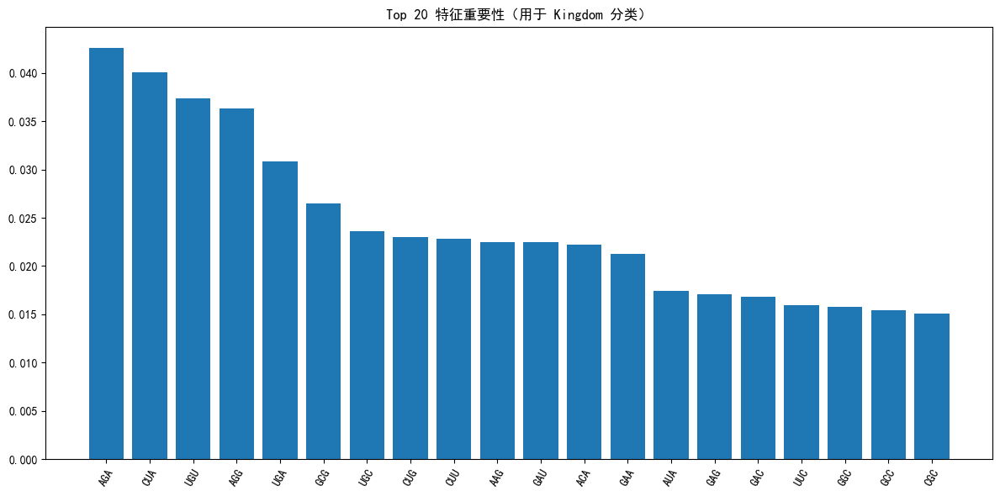
    


```python
# 类别标签
labels = ['arc', 'bct', 'inv', 'mam', 'phg', 'plm', 'pln', 'pri', 'rod', 'vrl', 'vrt']

# 对应的精确率、召回率、F1 分数
precision = [1.00, 0.91, 0.90, 0.92, 0.95, 0.00, 0.91, 0.92, 0.93, 0.88, 0.91]
recall =    [0.40, 0.96, 0.72, 0.80, 0.45, 0.00, 0.94, 0.64, 0.65, 0.98, 0.95]
f1_score =  [0.57, 0.93, 0.80, 0.85, 0.62, 0.00, 0.92, 0.75, 0.77, 0.92, 0.93]

x = np.arange(len(labels))
width = 0.25

plt.figure(figsize=(12, 6))
plt.bar(x - width, precision, width, label='精确率', color='skyblue')
plt.bar(x, recall, width, label='召回率', color='lightgreen')
plt.bar(x + width, f1_score, width, label='F1 分数', color='salmon')

plt.xlabel('Kingdom', fontsize=12)
plt.ylabel('Score', fontsize=12)
plt.title('精确率、召回率、F1 分数', fontsize=14)
plt.xticks(x, labels)
plt.ylim(0, 1.1)
plt.legend()
plt.grid(axis='y', linestyle='--', alpha=0.7)

plt.tight_layout()
plt.show()
```


    
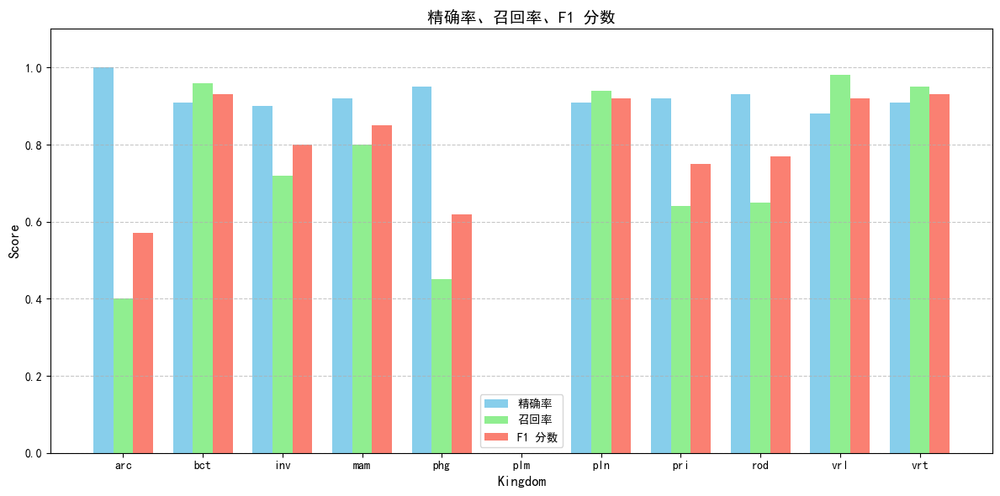
    


# 五、扩展分析


```python
kingdoms = df['Kingdom']
codon_columns = [col for col in p_codon.columns if col != 'Kingdom']
codon_usage = df[codon_columns].copy()

# 每个氨基酸对应的密码子表（简化版，完整表应覆盖全部 61 个编码密码子）
amino_acid_codons = {
    'Phe': ['TTT', 'TTC'],
    'Leu': ['TTA', 'TTG', 'CTT', 'CTC', 'CTA', 'CTG'],
    'Ile': ['ATT', 'ATC', 'ATA'],
    'Met': ['ATG'],
    'Val': ['GTT', 'GTC', 'GTA', 'GTG'],
    'Ser': ['TCT', 'TCC', 'TCA', 'TCG', 'AGT', 'AGC'],
    'Pro': ['CCT', 'CCC', 'CCA', 'CCG'],
    'Thr': ['ACT', 'ACC', 'ACA', 'ACG'],
    'Ala': ['GCT', 'GCC', 'GCA', 'GCG'],
    'Tyr': ['TAT', 'TAC'],
    'His': ['CAT', 'CAC'],
    'Gln': ['CAA', 'CAG'],
    'Asn': ['AAT', 'AAC'],
    'Lys': ['AAA', 'AAG'],
    'Asp': ['GAT', 'GAC'],
    'Glu': ['GAA', 'GAG'],
    'Cys': ['TGT', 'TGC'],
    'Trp': ['TGG'],
    'Arg': ['CGT', 'CGC', 'CGA', 'CGG', 'AGA', 'AGG'],
    'Gly': ['GGT', 'GGC', 'GGA', 'GGG'],
    # 终止密码子不考虑
}

# 构建密码子到氨基酸的映射
codon_to_aa = {}
for aa, codons in amino_acid_codons.items():
    for codon in codons:
        codon_to_aa[codon] = aa

# --- 计算 GC3、Nc、CAI ---

def compute_gc3(row):
    third_bases = [codon[-1] for codon in codon_columns]
    gc3_count = sum(row[codon] for codon in codon_columns if codon[-1] in 'GC')
    total = row[codon_columns].sum()
    return gc3_count / total if total > 0 else np.nan

def compute_nc(row):
    F_values = {}
    for aa, codons in amino_acid_codons.items():
        total = sum(row.get(c, 0) for c in codons)
        if total == 0:
            continue
        pi_sq = [(row.get(c, 0) / total)**2 for c in codons]
        F = (sum(pi_sq) - 1/len(codons)) / (1 - 1/len(codons)) if len(codons) > 1 else 1.0
        if F > 0:
            F_values[len(codons)] = F_values.get(len(codons), []) + [F]
    Nc = 2
    for k in [2, 3, 4, 6]:
        Fk = np.mean(F_values.get(k, [1.0]))
        Nc += (k if k != 2 else 9) / Fk
    return Nc

def compute_cai(row, reference_row):
    weights = []
    for codon in codon_columns:
        aa = codon_to_aa.get(codon)
        if not aa:
            continue
        synonymous_codons = amino_acid_codons[aa]
        ref_max = max(reference_row.get(c, 1e-6) for c in synonymous_codons)
        weight = row[codon] / ref_max if ref_max > 0 else 0
        if weight > 0:
            weights.append(np.log(weight))
    if weights:
        return np.exp(sum(weights) / len(weights))
    return np.nan

# 使用 Kingdom 为 bct 的平均值作为 CAI 参考
reference_row = codon_usage[kingdoms == 'bct'].mean()

# 批量计算指标
df['GC3'] = codon_usage.apply(compute_gc3, axis=1)
df['Nc'] = codon_usage.apply(compute_nc, axis=1)
df['CAI'] = codon_usage.apply(lambda row: compute_cai(row, reference_row), axis=1)

# 汇总统计：按 Kingdom 计算平均值
summary = df.groupby('Kingdom')[['GC3', 'Nc', 'CAI']].mean().reset_index()
summary
```


<div>
<style scoped>
    .dataframe tbody tr th:only-of-type {
        vertical-align: middle;
    }

    .dataframe tbody tr th {
        vertical-align: top;
    }

    .dataframe thead th {
        text-align: right;
    }
</style>
<table border="1" class="dataframe">
  <thead>
    <tr style="text-align: right;">
      <th></th>
      <th>Kingdom</th>
      <th>GC3</th>
      <th>Nc</th>
      <th>CAI</th>
    </tr>
  </thead>
  <tbody>
    <tr>
      <th>0</th>
      <td>arc</td>
      <td>0.714528</td>
      <td>47.209629</td>
      <td>0.526134</td>
    </tr>
    <tr>
      <th>1</th>
      <td>bct</td>
      <td>0.744009</td>
      <td>44.293987</td>
      <td>0.528513</td>
    </tr>
    <tr>
      <th>2</th>
      <td>inv</td>
      <td>0.647926</td>
      <td>46.286964</td>
      <td>0.467696</td>
    </tr>
    <tr>
      <th>3</th>
      <td>mam</td>
      <td>0.656468</td>
      <td>39.151521</td>
      <td>0.452877</td>
    </tr>
    <tr>
      <th>4</th>
      <td>phg</td>
      <td>0.687507</td>
      <td>50.795848</td>
      <td>0.528467</td>
    </tr>
    <tr>
      <th>5</th>
      <td>plm</td>
      <td>0.789820</td>
      <td>51.704247</td>
      <td>0.659906</td>
    </tr>
    <tr>
      <th>6</th>
      <td>pln</td>
      <td>0.666520</td>
      <td>49.276205</td>
      <td>0.489739</td>
    </tr>
    <tr>
      <th>7</th>
      <td>pri</td>
      <td>0.710507</td>
      <td>43.225717</td>
      <td>0.511657</td>
    </tr>
    <tr>
      <th>8</th>
      <td>rod</td>
      <td>0.655085</td>
      <td>39.859976</td>
      <td>0.500836</td>
    </tr>
    <tr>
      <th>9</th>
      <td>vrl</td>
      <td>0.686973</td>
      <td>51.643444</td>
      <td>0.568125</td>
    </tr>
    <tr>
      <th>10</th>
      <td>vrt</td>
      <td>0.690445</td>
      <td>41.345184</td>
      <td>0.493528</td>
    </tr>
  </tbody>
</table>
</div>


```python
# 加载数据
data = pd.DataFrame({
    'Kingdom': ['arc', 'bct', 'inv', 'mam', 'phg', 'plm', 'pln', 'pri', 'rod', 'vrl', 'vrt'],
    'GC3': [0.714528, 0.744009, 0.647926, 0.656468, 0.687507, 0.789820, 0.666520, 0.710507, 0.655085, 0.686973, 0.690445],
    'Nc': [47.209629, 44.293987, 46.286964, 39.151521, 50.795848, 51.704247, 49.276205, 43.225717, 39.859976, 51.643444, 41.345184],
    'CAI': [0.526134, 0.528513, 0.467696, 0.452877, 0.528467, 0.659906, 0.489739, 0.511657, 0.500836, 0.568125, 0.493528]
})

# 设置中文字体支持（可选）
plt.rcParams["font.family"] = ["SimHei", "Arial"]

# 绘制图
fig, axs = plt.subplots(3, 1, figsize=(10, 12))

axs[0].bar(data['Kingdom'], data['GC3'], color='skyblue')
axs[0].set_title('GC3 含量')
axs[0].set_ylabel('GC3')

axs[1].bar(data['Kingdom'], data['Nc'], color='orange')
axs[1].set_title('Nc 值（密码子使用有效数）')
axs[1].set_ylabel('Nc')

axs[2].bar(data['Kingdom'], data['CAI'], color='green')
axs[2].set_title('CAI 值（密码子适应指数）')
axs[2].set_ylabel('CAI')

plt.tight_layout()
plt.show()
```


    
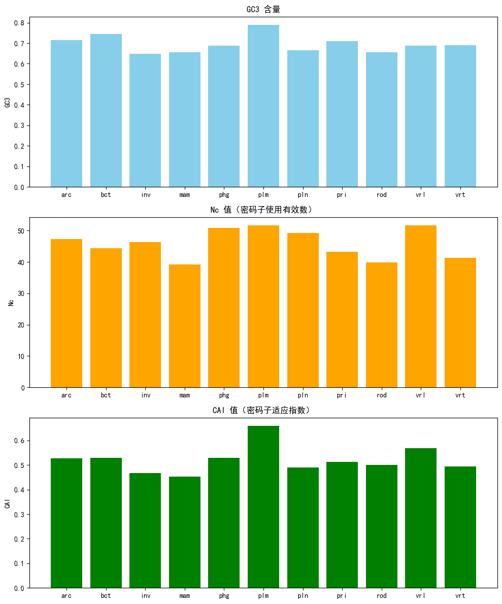
    


## 结果分析

### 密码子偏好（Codon Usage Bias, CUB）
指同义密码子在不同生物中使用频率存在系统性差异的现象。它受到两类主要因素的影响：

* **翻译选择压力**（Translational Selection）：高表达基因倾向于使用效率更高的密码子。
* **突变偏好**（Mutational Bias）：如 GC 含量变化导致的密码子频率偏差。

### 指标差异分析

#### 1. GC3 含量 —— 突变偏好的证据

GC3 含量是第三位碱基为 G/C 的比例，它是用来判断突变偏好的重要指标。原核类（如 arc、bct）和原生生物（plm）拥有显著较高的 GC3 含量（>0.71），说明其密码子使用更受**碱基突变偏好**的影响。而哺乳类（mam、rod）GC3 相对适中，表明突变压力并非主要因素。

#### 2. Nc 值 —— 密码子使用集中度

Nc 值越低，表示密码子使用越偏向某些种类。`mam` 和 `rod` 的 Nc 值最低（\~39），说明其密码子偏好**最强**，可能受到强烈的翻译效率选择压力影响。

而病毒（vrl）和原生生物（plm）Nc 值较高（>51），说明密码子使用较为“随机”，偏好不明显，可能由于基因组受宿主影响或突变率高。

#### 3. CAI —— 翻译选择压力指标

CAI 衡量一个生物密码子使用是否接近高表达参考基因。CAI 高的 Kingdom 如 `plm`（0.66）和 `vrl`（0.57），说明其基因表达系统或病毒粒子形成过程对密码子效率存在**强烈选择压力**。

反之，`mam`（0.45）和 `inv`（0.46）的 CAI 较低，表明其密码子使用与“高表达参考密码子”一致性较弱，或存在较多低表达基因。

---

### 综合讨论

| Kingdom 类别 | GC3（突变） | Nc（集中） | CAI（表达选择） | 推测主导机制      |
| ---------- | ------- | ------ | --------- | ----------- |
| arc, bct   | 高       | 中      | 中         | 突变主导 + 少量选择 |
| mam, rod   | 中       | 低      | 低         | 翻译选择主导      |
| plm, vrl   | 高       | 高      | 高         | 两种机制并存      |
| inv, vrt   | 中       | 中      | 中         | 混合机制或选择弱    |

本研究表明，不同生物类群的密码子偏好形成机制具有显著差异：

* \*\*原核类（bct, arc）\*\*密码子偏好较弱，GC3 高，突变主导；
* \*\*真核高等动物（mam, rod）\*\*密码子偏好最强，受翻译效率强烈选择；
* \*\*病毒与原生生物（vrl, plm）\*\*同时表现出高 GC3、高 CAI，可能同时受到突变和功能需求影响。

# 六、结论

* 密码子偏好是多因素驱动的结果，不同 Kingdom 表现出不同主导机制；
* 指标的联合使用（GC3, Nc, CAI）可以帮助理解密码子偏好的生物学背景；
* 病毒与寄生原生生物密码子偏好模式独特，值得在进化和宿主适应角度深入研究。

# 参考文献


```python

```
